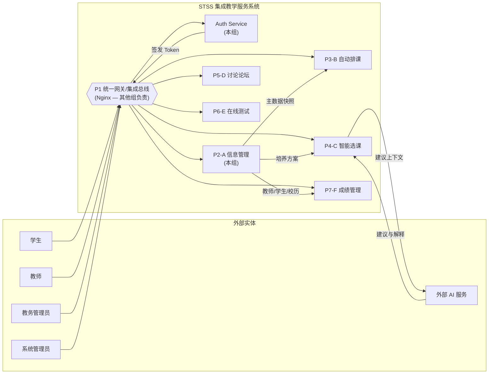

# 01 — 系统总体架构

## 1. 系统上下文

STSS（Smart Teaching Service System）是一个集成教学服务系统，由 **6 个子系统（A~F）** 通过统一网关/总线协同工作。



> **说明**：本组仅负责 **Auth Service** 和 **Info Service（P2-A 信息管理）**。Gateway/Bus 由其他组基于 Nginx 实现，本组不实现。

## 2. 在 STSS 大组中的定位

### 2.1 角色定位

- **P2-A 信息管理**：全系统的"主数据源头"，负责用户、课程、校历、培养方案等基础数据的维护与发布。
- **Auth Service**：全系统的"认证授权中心"，负责身份认证、令牌签发、公钥分发。
- 两个服务配合，向 B（排课）、C（选课）、F（成绩）提供主数据消费接口。Info Service 仅提供数据基线（baseline），选课业务逻辑由 C 系统负责。

### 2.2 主数据流

```
A（信息管理）
  ├─ 教师名单、校历 ──→ B（排课）
  ├─ 培养方案 ──→ C（选课）
  └─ 教师/学生/校历 ──→ F（成绩）
```

### 2.3 跨子系统通信模型

```
用户请求 → Nginx Gateway → Gateway 调用 Auth Service 验签 → 透传身份 Header
  → Auth Service（签发/验证 Token，提供 /internal/verify）
  → Info Service（信任 Gateway Header → 业务处理 → 返回结果）
```

- **用户态请求**：Gateway 调用 Auth Service `/internal/verify` 完成 JWT 验签与身份提取，然后通过 `X-User-Id`、`X-User-Role`、`X-User-Permissions` Header 透传给下游服务。下游服务不再本地验签。
- **服务态请求**：系统间调用使用 Service Token（通过 `/auth/sys/login` 签发），Gateway 同样调用 Auth Service 校验并透传身份 Header。

## 3. 服务职责与边界

| 服务 | 负责方 | 端口 | 职责 |
|------|--------|------|------|
| Gateway/Bus | 其他组（Nginx） | 8000 | 统一入口、路由转发、限流、X-Request-ID 生成 |
| **Auth Service** | **本组** | 8001 | 认证、令牌签发/续期/撤销、公钥分发、身份提取、权限定义 |
| **Info Service** | **本组** | 8002 | 用户管理、课程管理、基础信息、回收站、校历、培养方案、文件存储、主数据快照发布、审计日志写入 |
| 日志查询 | **本组**（Info 子模块） | — | 审计日志检索与导出，作为 Info Service 的子模块实现 |

### 3.1 服务边界原则

1. **Auth Service 不持有用户业务数据**：仅存储认证所需的最小字段（userId、username、status），用户详细信息由 Info Service 管理。
2. **Info Service 不签发 Token**：所有认证相关操作统一走 Auth Service。
3. **跨服务以 userId 关联**：两个服务的数据库通过 `userId` 逻辑关联，不建立外键约束。

## 4. 技术栈决策

### 4.1 后端

| 组件 | 选择 | 决策理由 |
|------|------|----------|
| 框架 | Python FastAPI | 异步高性能、自动 OpenAPI 文档、类型安全（Pydantic） |
| ORM | SQLModel | 与 FastAPI/Pydantic 原生适配，减少 Schema 重复定义 |
| 数据库 | SQLite（原型）→ PostgreSQL | 原型阶段零配置部署；Alembic 管理迁移，切换仅需改连接串 |
| 迁移工具 | Alembic | 支持 SQLite → PostgreSQL 平滑切换 |
| 认证 | JWT（HS256） | 对称密钥，原型阶段简单可靠；预留 RS256 + JWKS 扩展点 |
| 跨服务通信 | HTTP 同步 + 补偿重试 | 原型阶段不引入 MQ，但预留事件发布接口 |
| 容器化 | Docker + Docker Compose | 环境一致性，一键启动 |

### 4.2 前端

| 组件 | 选择 | 决策理由 |
|------|------|----------|
| 框架 | Vue 3 + Composition API | 学习曲线平缓，团队前端经验有限 |
| 语言 | TypeScript | 类型安全，减少运行时错误 |
| UI 库 | Element Plus | 完整的管理后台组件生态 |
| 构建 | Vite | 快速 HMR，开发体验好 |
| 状态管理 | Pinia | 官方推荐，轻量替代 Vuex |
| 路由 | Vue Router 4.x | 官方路由方案 |
| HTTP | Axios | 拦截器机制支持 Token 自动续期 |

### 4.3 为什么不引入 MQ

- 原型阶段跨服务调用频次低（用户创建、角色变更等管理操作）。
- HTTP 同步调用 + 补偿重试足够覆盖当前一致性需求。
- 预留事件发布接口（Python `Protocol` 定义），后期可替换为 Redis Pub/Sub 或 RabbitMQ 实现。

## 5. 关键架构决策记录（ADR）

| ID | 决策 | 理由 | 权衡 |
|----|------|------|------|
| ADR-001 | Auth DB 与 Info DB 独立 | 职责分离，独立部署 | 跨库操作需补偿机制 |
| ADR-002 | 原型用 HS256 对称密钥 | 简化部署，单密钥管理 | 多子系统扩展时需迁移至 RS256 |
| ADR-003 | 原型不引入 MQ | 降低复杂度 | 跨服务写入非实时一致 |
| ADR-004 | 前端仅实现管理端 | 需求范围限定 | 普通用户通过其他子系统接入 |
| ADR-005 | SQLite 作为原型数据库 | 零配置，快速启动 | 并发写入能力有限 |
