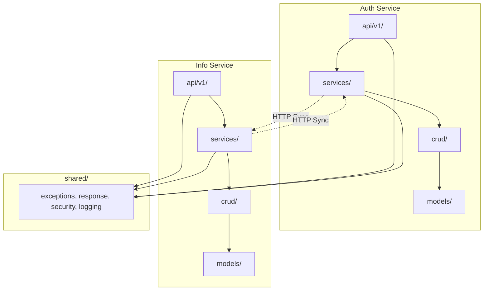

# 02 — 模块架构

## 1. 分层架构

两个服务统一采用 **Router → Service → CRUD → Model** 四层单向依赖架构，遵循 Clean Architecture 的依赖规则。

```
┌─────────────────────────────────────────────────┐
│                  Router 层                       │
│  api/v1/  — 薄路由：参数校验、调用 Service、     │
│             返回 Schema，不写业务逻辑             │
├─────────────────────────────────────────────────┤
│                  Service 层                      │
│  services/  — 厚服务：业务逻辑、权限校验、        │
│               跨模块编排、事务管理                 │
├─────────────────────────────────────────────────┤
│                  CRUD 层                         │
│  crud/  — 数据访问：纯 SQL/ORM 操作，            │
│           不包含业务判断                          │
├─────────────────────────────────────────────────┤
│                  Model 层                        │
│  models/  — SQLModel 实体定义，                  │
│            纯粹的数据结构映射                      │
└─────────────────────────────────────────────────┘
```

### 1.1 依赖规则

- Router → 依赖 Service（调用一个或多个 Service 方法）
- Service → 依赖 CRUD（通过 CRUD 访问数据）+ 其他 Service（编排）
- CRUD → 依赖 Model（ORM 操作）
- Model → 无依赖（纯数据结构）
- **禁止反向依赖**：CRUD 不可导入 Service，Service 不可导入 Router

### 1.2 跨层横切关注点

- `schemas/`：Pydantic 请求/响应 Schema，被 Router 和 Service 共用。
- `core/`：配置、异常定义、安全工具，所有层均可依赖。

## 2. 项目目录结构

```
project/
├── auth_service/
│   ├── main.py                # FastAPI 应用入口
│   ├── api/
│   │   └── v1/
│   │       ├── __init__.py
│   │       ├── router.py      # 聚合所有子路由
│   │       ├── auth.py        # /auth/* 端点
│   │       └── internal.py    # /internal/* 内部端点
│   ├── services/
│   │   ├── auth_service.py    # 登录、令牌签发/续期/撤销
│   │   ├── key_service.py     # 密钥管理、JWKS 发布
│   │   └── identity_service.py # Token 验签、身份提取（供 Gateway 调用）
│   ├── crud/
│   │   ├── credential_crud.py
│   │   ├── token_crud.py
│   │   ├── session_crud.py
│   │   ├── role_crud.py
│   │   └── permission_crud.py
│   ├── models/
│   │   ├── credential.py
│   │   ├── token.py
│   │   ├── session.py
│   │   ├── role.py
│   │   ├── permission.py
│   │   └── user.py            # 最小字段集
│   ├── schemas/
│   │   ├── auth_schema.py     # 登录/登出/刷新 请求响应
│   │   └── user_schema.py
│   └── core/
│       ├── config.py          # Pydantic Settings
│       ├── security.py        # JWT 签发/验签
│       └── exceptions.py
│
├── info_service/
│   ├── main.py
│   ├── api/
│   │   └── v1/
│   │       ├── __init__.py
│   │       ├── router.py
│   │       ├── users.py       # /users/*
│   │       ├── courses.py     # /courses/*
│   │       ├── offerings.py   # /offerings/*
│   │       ├── schedules.py   # /schedules/*
│   │       ├── calendars.py   # /calendars/*
│   │       ├── training_programs.py
│   │       ├── base_info.py
│   │       ├── recycle_bin.py
│   │       ├── files.py
│   │       ├── audit_logs.py
│   │       └── data_provision.py  # /data-provision/*
│   ├── services/
│   │   ├── user_management_service.py
│   │   ├── course_management_service.py
│   │   ├── data_provision_service.py
│   │   ├── recycle_bin_service.py
│   │   ├── file_storage_service.py
│   │   └── audit_service.py
│   ├── crud/
│   │   ├── user_crud.py
│   │   ├── user_profile_crud.py
│   │   ├── course_crud.py
│   │   ├── offering_crud.py
│   │   ├── schedule_crud.py
│   │   ├── classroom_crud.py
│   │   ├── calendar_crud.py
│   │   ├── training_program_crud.py
│   │   ├── base_info_crud.py
│   │   ├── file_resource_crud.py
│   │   └── audit_log_crud.py
│   ├── models/
│   │   ├── user.py
│   │   ├── user_profile.py
│   │   ├── course.py
│   │   ├── course_offering.py
│   │   ├── course_schedule.py
│   │   ├── classroom.py
│   │   ├── teacher_assignment.py
│   │   ├── course_prerequisite.py
│   │   ├── academic_calendar.py
│   │   ├── training_program.py
│   │   ├── base_info_item.py
│   │   ├── file_resource.py
│   │   └── audit_log.py
│   ├── schemas/
│   │   ├── user_schema.py
│   │   ├── course_schema.py
│   │   └── ...（按模块对应）
│   └── core/
│       ├── config.py
│       ├── security.py        # 身份 Header 读取、权限校验
│       └── exceptions.py
│
├── shared/
│   ├── exceptions.py          # 统一异常类
│   ├── response.py            # 统一响应格式
│   ├── security.py            # JWT 工具（验签、身份提取）
│   └── logging.py             # AppLogger 封装
│
├── docker-compose.yml
├── .env                       # 开发环境变量
└── .env.prod                  # 生产环境变量
```

## 3. Auth Service 内部模块

### 3.1 Router 层

| 端点 | 方法 | 对应 Service 方法 |
|------|------|-------------------|
| `/auth/login` | POST | `AuthService.login()` |
| `/auth/sys/login` | POST | `AuthService.service_login()` |
| `/auth/logout` | POST | `AuthService.logout()` |
| `/auth/refresh` | POST | `AuthService.refresh_token()` |
| `/auth/me` | GET | `AuthService.get_current_user()` |
| `/auth/change-password` | POST | `AuthService.change_password()` |
| `/auth/public-key` | GET | `KeyService.get_public_keys()` |
| `/internal/verify` | POST | `IdentityService.verify_token()` |
| `/internal/users` | POST | `AuthService.create_internal_user()` |
| `/internal/users/{id}/disable` | POST | `AuthService.disable_user()` |
| `/internal/users/{id}/enable` | POST | `AuthService.enable_user()` |
| `/internal/users/{id}/roles` | POST | `AuthService.sync_user_roles()` |
| `/internal/users/{id}` | DELETE | `AuthService.delete_user()` |

### 3.2 Service 层

**AuthService** — 核心认证逻辑：
- `login(username, password)` → 验证凭据 → 签发 Access + Refresh Token → 创建会话
- `service_login(client_id, client_secret)` → 验证服务身份 → 签发 Service Token
- `logout(session_id)` → 撤销 Refresh Token
- `refresh_token(refresh_token)` → 验证 → 签发新 Token 对
- `change_password(user_id, old_pw, new_pw)` → 验证旧密码 → 更新哈希
- 登录保护：连续失败 5 次 → 锁定 10 分钟

**KeyService** — 密钥管理：
- 管理当前及历史签名密钥
- 提供 JWKS 格式公钥集（`/auth/public-key`）
- 预留密钥轮换能力

**IdentityService** — 身份验证（供 Gateway 调用）：
- 验签 JWT（Access Token / Service Token）
- 提取 `sub`（userId）、`role`、`permissions`
- 通过 `/internal/verify` 端点暴露，仅内网可达

### 3.3 CRUD 层

| CRUD 模块 | 操作模型 | 职责 |
|-----------|----------|------|
| CredentialCRUD | Credential | 密码哈希读写、失败计数、锁定状态 |
| TokenCRUD | Token | Token 持久化、撤销标记 |
| SessionCRUD | AuthenticationSession | 会话生命周期管理 |
| RoleCRUD | Role, UserRole, RolePermission | 角色与权限映射 |
| PermissionCRUD | Permission | 权限点定义 |

### 3.4 Model 层

| 模型 | 核心字段 |
|------|----------|
| User（最小集） | userId, username, status |
| Credential | userId, username, passwordHash, passwordSalt, failedLoginCount, lockedUntil |
| Token | userId, type(ACCESS/REFRESH), tokenValue, issuedAt, expiresAt, revokedAt |
| AuthenticationSession | userId, accessTokenId, refreshTokenId, status(ACTIVE/ENDED/EXPIRED) |
| Role | code, name, description, isActive |
| Permission | code(resource:action), name, resource, action |
| UserRole | userId, roleId |
| RolePermission | roleId, permissionId |

## 4. Info Service 内部模块

### 4.1 Service 层

**UserManagementService** — 用户全生命周期：
- `create_user()` → 写 Info DB → HTTP 调用 Auth Service → 补偿删除
- `update_user()` / `update_profile()` / `disable_user()` / `enable_user()`
- `logical_delete_user()` → 标记 isDeleted → HTTP 禁用 Auth 账号
- `restore_user()` → 清除 isDeleted → HTTP 启用 Auth 账号
- `batch_import_users()` → CSV 解析 → 逐条创建 → 汇总结果

**CourseManagementService** — 课程与教学资源：
- 课程 CRUD、开课 CRUD、排课 CRUD
- 教室管理、教师分配、先修课程维护
- 校历管理、培养方案管理、基础信息条目管理

**DataProvisionService** — 面向 B/C/F 的数据提供：
- `list_teachers()` / `list_candidate_students()` / `get_calendars()`
- `get_training_programs()` / `query_selected_students()`
- 返回结果附加 `snapshotTime` / `version`

**RecycleBinService** — 回收站：
- `list_deleted_users()` / `restore_user()` / `physical_delete()` / `batch_physical_delete()`

**FileStorageService** — 文件管理：
- `upload_file()` → 校验类型/大小 → 落盘 → 写元数据
- `delete_file()` / `get_file()` / `generate_access_url()`

**AuditService** — 审计日志：
- `write_audit_log()` — 高风险操作记录
- `search_audit_logs()` — 按时间/用户/操作类型检索
- `export_audit_logs()` — CSV 导出

### 4.2 CRUD 层

| CRUD 模块 | 对应模型 | 职责 |
|-----------|----------|------|
| UserCRUD | User | 用户主表操作 |
| UserProfileCRUD | UserProfile | 档案/状态管理 |
| CourseCRUD | Course | 课程主数据 |
| OfferingCRUD | CourseOffering | 开课实例 |
| ScheduleCRUD | CourseSchedule | 排课记录 |
| ClassroomCRUD | Classroom | 教室资源 |
| CalendarCRUD | AcademicCalendar | 校历数据 |
| TrainingProgramCRUD | TrainingProgram | 培养方案 |
| BaseInfoCRUD | BaseInfoItem | 通用基础信息 |
| FileResourceCRUD | FileResource | 文件元数据 |
| AuditLogCRUD | AuditLog | 审计日志读写 |

## 5. 共享模块（shared/）

`shared/` 目录存放两个服务共用的代码，避免重复：

| 模块 | 内容 |
|------|------|
| `exceptions.py` | 统一异常类层次：`AppException` → `AuthenticationException`、`AuthorizationException`、`ResourceNotFoundException`、`BusinessRuleException` |
| `response.py` | 统一响应格式：`APIResponse(code, message, data)` / `PaginatedResponse(items, pagination)` |
| `security.py` | 身份 Header 读取、权限校验装饰器 `@require_permission("user:read")` |
| `logging.py` | `AppLogger` 封装：JSON 格式、四级日志、X-Request-ID 自动注入 |

## 6. 模块间依赖关系



> 虚线表示跨服务 HTTP 调用，非代码级依赖。
