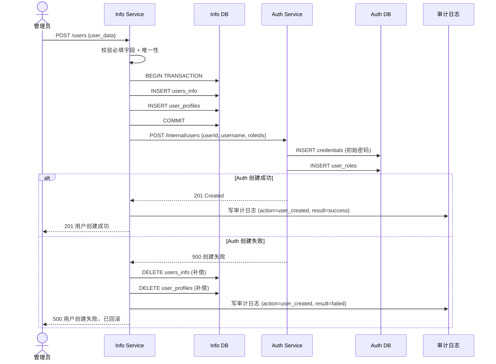
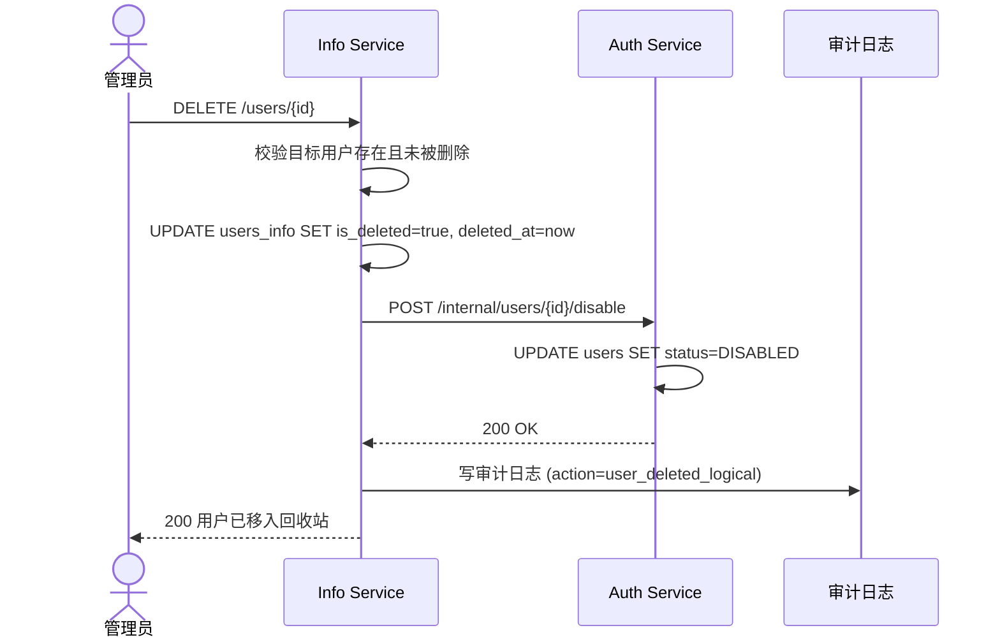
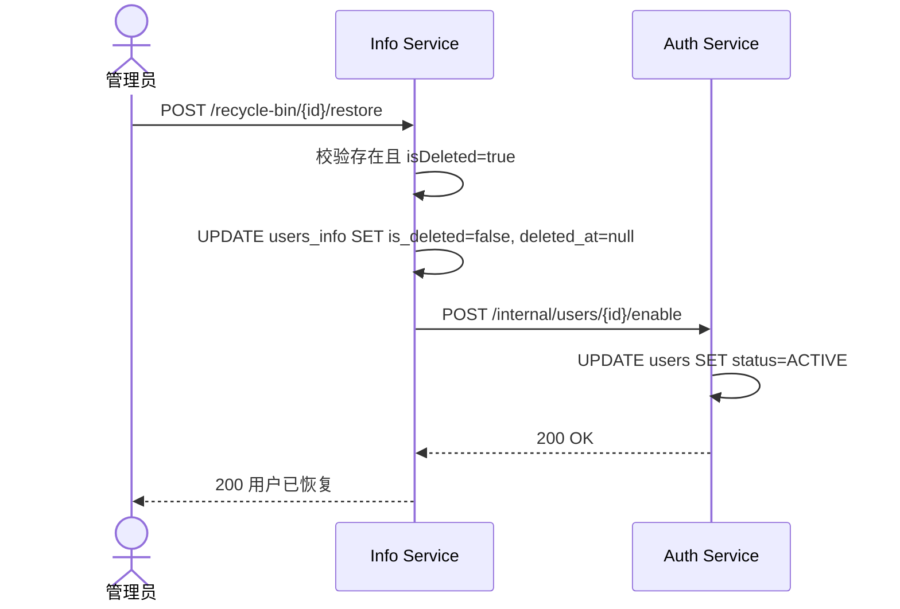
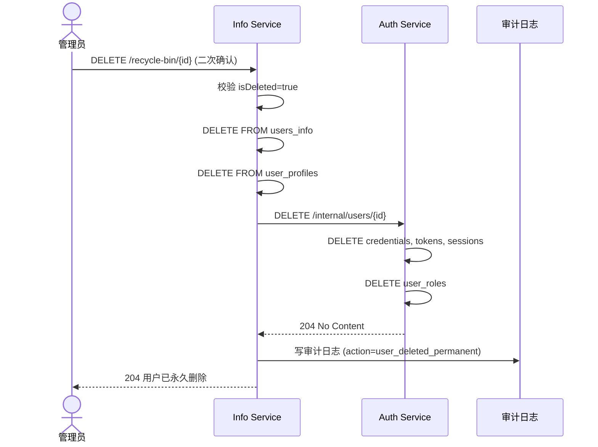
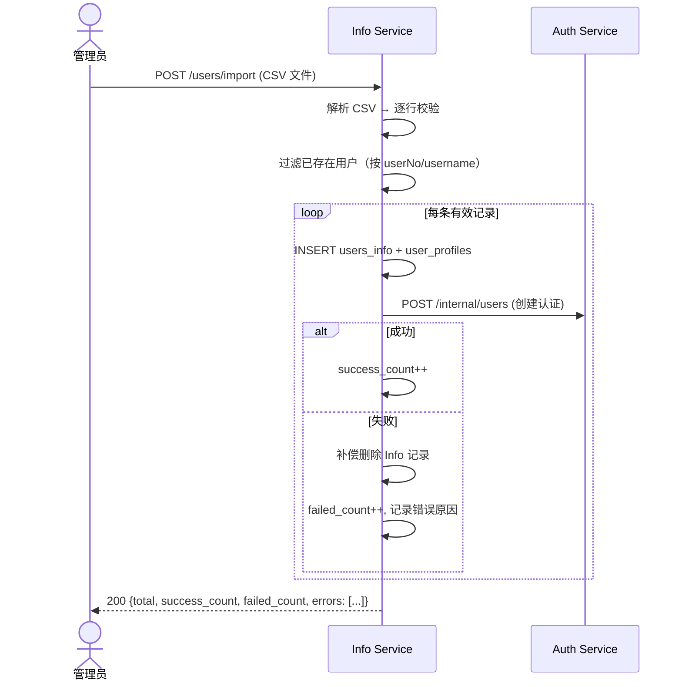
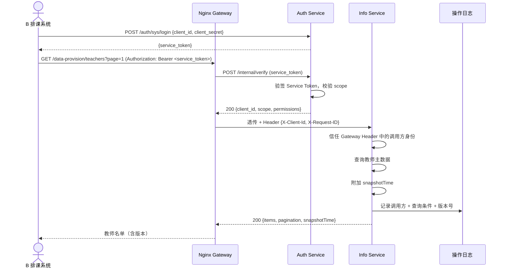
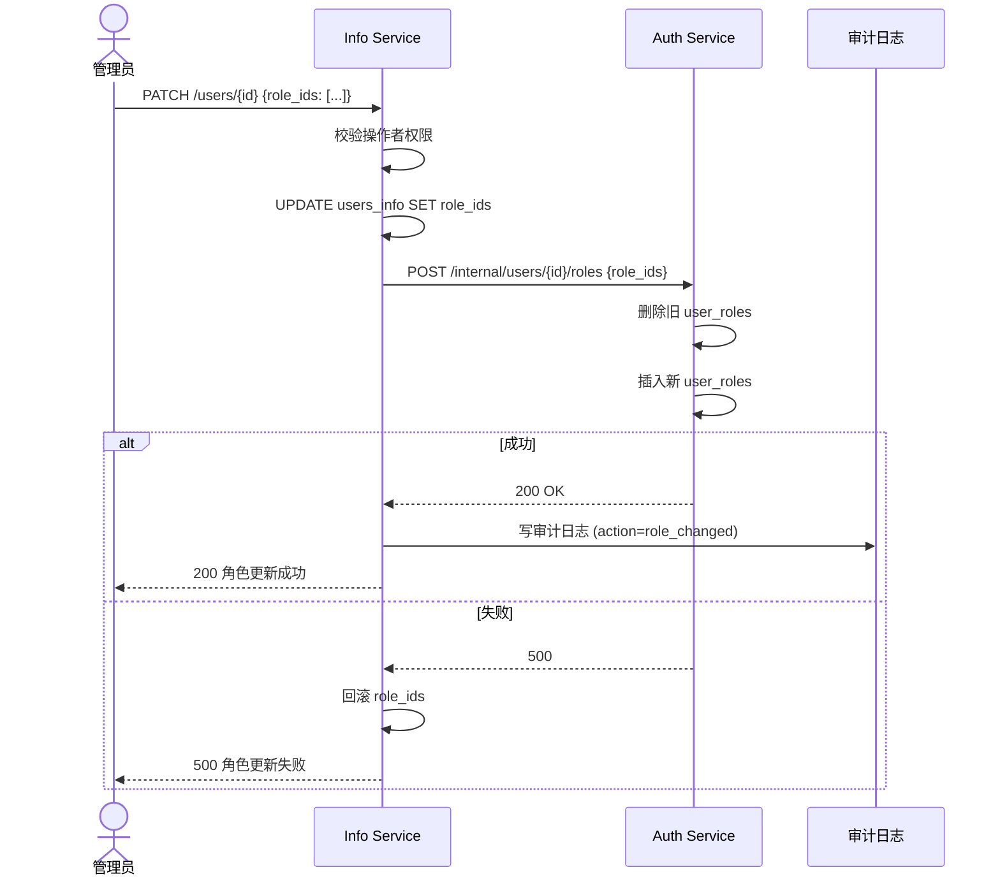

# 06 — 业务流程设计

## 1. 用户创建流程（跨服务）

## 2. 用户删除与恢复流程

### 2.1 逻辑删除

### 2.2 回收站恢复

### 2.3 物理删除

## 3. 批量导入流程

## 4. 数据提供流程（向 B/C 系统）

## 5. 角色变更流程

## 6. 与 data_flow 的 L2 对齐

本系统对应 [data_flow](../../require-spec/data_flow/group_bus_L0_L1_L2_integrated.md) 中 **子系统 A（P2 信息管理）** 的 L2 分解：

| L2 过程 | 实现模块 | 关键逻辑 |
|---------|----------|----------|
| P2.1 请求解析与鉴权上下文 | Router + shared/security.py | 读取 Gateway 透传的身份 Header（X-User-Id、X-User-Role、X-User-Permissions），构建鉴权上下文 |
| P2.2 用户与档案维护 | UserManagementService | CRUD + 跨服务同步 |
| P2.3 课程校历培养方案维护 | CourseManagementService | 课程/开课/排课/校历/方案 CRUD |
| P2.4 权限变更与回收站处理 | UserManagementService + RecycleBinService | 角色同步 + 逻辑/物理删除 |
| P2.5 主数据快照发布与审计 | DataProvisionService + AuditService | HTTP 快照提供 + 审计写入 |

> L2 数据流图中使用事件总线（MQ）发布主数据快照。原型阶段改为 HTTP 同步提供（`/data-provision/*`），但预留 `EventPublisher` 接口（Python Protocol），后续可替换为 MQ 实现。
