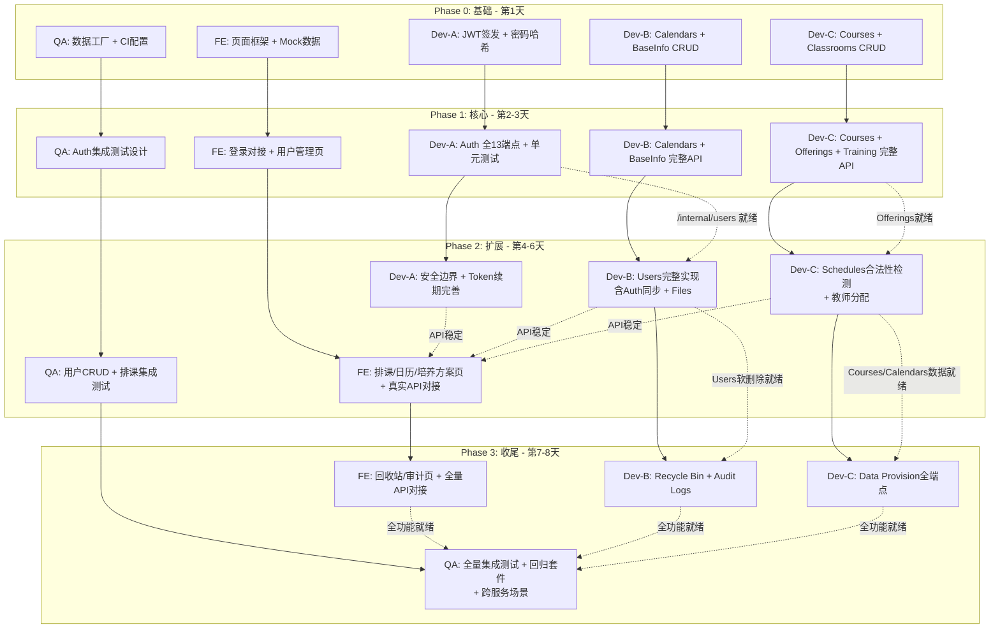

# 任务分工建议

> 3 开发 + 1 测试 + 1 前端，按模块拆分。每个人独立分支工作，通过 PR 合入 main。

---

## 1. 测试策略

### 核心原则

**单元测试由开发者自行编写**，随代码一起提交。QA 专注于集成测试、冒烟测试、回归测试和测试基础设施维护。

### 测试类型区分

| 类型 | 编写者 | 目的 | 典型耗时 | 关注重点 |
|------|--------|------|----------|----------|
| **冒烟测试** | QA | 验证系统能否跑起来（基础设施连通性） | < 2s | App 可达、DB 可读写、中间件生效、路由注册 |
| **单元测试** | 开发者 | 隔离测试单个组件逻辑正确性 | < 10s | CRUD SQL 正确性、Service 业务逻辑（Mock 外部依赖）、工具函数边界 |
| **集成测试** | QA | 验证完整 Router→Service→CRUD→Model 链路 | < 60s | HTTP 请求全链路、响应格式、补偿回滚、DB 状态变更 |
| **回归测试** | QA | 确保已修复 Bug 不再出现 | 不定 | 最小复现用例、标记 `@pytest.mark.regression` |

#### 冒烟测试关注重点

- FastAPI app 是否可启动（`TestClient` 能访问）
- 数据库引擎是否可创建、会话是否可读写（每个 DB 一条 INSERT + SELECT）
- 核心中间件是否生效（RequestID Header 回显、CORS 配置）
- OpenAPI schema 是否可生成（`/openapi.json` 返回 200）
- 关键路由是否注册（auth/login、users、courses 等不返回 404）

冒烟测试**不测试业务逻辑正确性**，只测试基础设施连通性。已有 12 个冒烟测试在 `tests/test_infra.py`，QA 负责扩展和维护。

#### 单元测试关注重点（开发者）

- CRUD 层：每个方法的 SQL 查询是否正确（用内存 SQLite，真实建表 + 真实查询）
- Service 层：业务逻辑是否正确（Mock 外部依赖如 Auth HTTP 调用、文件系统）
- 工具函数：边界输入、异常路径
- 隔离运行，不依赖外部服务，不启动 HTTP 客户端

#### 集成测试关注重点（QA）

- 通过 `async_client` 发真实 HTTP 请求，走完整 FastAPI 路由
- 验证响应状态码、`APIResponse` 格式、业务数据正确性
- 正常路径 + 参数化边界路径 + 异常路径
- 跨服务场景（Info 调 Auth）——验证补偿回滚是否生效
- 参考 `docs/require-spec/validation_matrices/` 下 4 份验证矩阵设计用例

---

## 2. 模块总览

### Dev-A：Auth Service（认证授权）— 1 人

| 层 | 文件 | 说明 |
|-----|------|------|
| Core | `core/security.py` | JWT 签发/验签、密码哈希、JWKS 密钥管理 |
| Core | `core/config.py` | 已完成 |
| CRUD | `crud/credential_crud.py` | 凭据增删改查、登录失败计数、账户锁定 |
| CRUD | `crud/token_crud.py` | Token 记录管理（签发/吊销/查询） |
| CRUD | `crud/session_crud.py` | 会话生命周期管理 |
| CRUD | `crud/role_crud.py` | 角色 CRUD + 用户角色关联 |
| CRUD | `crud/permission_crud.py` | 权限查询 + 角色权限关联 |
| Service | `services/auth_service.py` | 登录/登出/刷新/改密/用户管理 |
| Service | `services/key_service.py` | JWKS 公钥发布 + 密钥轮换 |
| Service | `services/identity_service.py` | 内部 Token 验签 |
| API | `api/v1/auth.py` | 7 个公开端点 |
| API | `api/v1/internal.py` | 6 个内部端点 |
| **单元测试** | `tests/auth_service/` | 由 Dev-A 编写（见下方清单） |

**13 个端点** · 建议顺序：Core → CRUD → Service → API

### Dev-B：Info Service — 用户与横切域 — 1 人

| 层 | 文件 | 说明 |
|-----|------|------|
| CRUD | `crud/user_crud.py` | 用户 CRUD + 逻辑删除 |
| CRUD | `crud/user_profile_crud.py` | 用户档案 |
| CRUD | `crud/calendar_crud.py` | 校历 CRUD + `by-term` 查询 |
| CRUD | `crud/base_info_crud.py` | 基础信息项 + 按 category 过滤 |
| CRUD | `crud/file_resource_crud.py` | 文件资源元数据 |
| CRUD | `crud/audit_log_crud.py` | 审计日志写入/搜索 |
| Service | `services/user_management_service.py` | 创建用户（含跨服务同步 Auth + 补偿回滚）、更新/删除/批量导入 |
| Service | `services/recycle_bin_service.py` | 回收站操作（含恢复时跨服务调用 Auth enable） |
| Service | `services/file_storage_service.py` | 文件上传/下载/删除 |
| Service | `services/audit_service.py` | 审计日志搜索/CSV 导出 |
| Service | `services/course_management_service.py` | 日历和基础信息相关方法（与 Dev-C 共享此文件） |
| API | `api/v1/users.py` | 8 个端点（含 CSV 导入） |
| API | `api/v1/recycle_bin.py` | 4 个端点 |
| API | `api/v1/calendars.py` | 7 个端点 |
| API | `api/v1/base_info.py` | 6 个端点 |
| API | `api/v1/files.py` | 3 个端点 |
| API | `api/v1/audit_logs.py` | 2 个端点 |
| **单元测试** | `tests/info_service/` | 由 Dev-B 编写（见下方清单） |

**约 29 个端点** · 关键难点：跨服务同步 Auth Service（创建用户时调用 `/internal/users`，失败需补偿回滚）

### Dev-C：Info Service — 课程与数据提供 — 1 人

| 层 | 文件 | 说明 |
|-----|------|------|
| CRUD | `crud/course_crud.py` | 课程 CRUD + 前置课程关联 |
| CRUD | `crud/offering_crud.py` | 课程开课 + 多维度过滤 |
| CRUD | `crud/schedule_crud.py` | 排课时间 + 教室合法性检测 |
| CRUD | `crud/classroom_crud.py` | 教室管理 |
| CRUD | `crud/training_program_crud.py` | 培养方案 + `by-major` 查询 |
| Service | `services/course_management_service.py` | 课程/开课/排课/教师分配/培养方案方法（与 Dev-B 共享此文件） |
| Service | `services/data_provision_service.py` | 数据快照提供（给 C/F 系统） |
| API | `api/v1/courses.py` | 6 个端点 |
| API | `api/v1/offerings.py` | 6 个端点 |
| API | `api/v1/schedules.py` | 11 个端点（含教师分配子资源） |
| API | `api/v1/training_programs.py` | 7 个端点 |
| API | `api/v1/data_provision.py` | 5 个端点 |
| **单元测试** | `tests/info_service/` | 由 Dev-C 编写（见下方清单） |

**约 36 个端点** · 关键难点：排课合法性检测、教师分配子资源嵌套

#### 排课"合法性检测"说明

**不做最优分配，只做合法性校验。** 复杂的最优排课求解属于 B 系统（P3 自动排课子系统），A 系统只确保已分配时间/教室的记录之间不存在硬冲突。

`check_conflict` 检测范围：
- **教室时间冲突**：同一教室（`classroom_id`）在同一天（`day_of_week`）同一时段（`start_period`~`end_period` 有重叠）不能有两条排课记录
- **教师冲突不在检测范围**：教师分配是独立子资源（`/schedules/{id}/teachers`），数据模型中无 `teacher_id` 列，教师维度冲突约束由 B 系统负责
- **周范围（`week_range`）**：数据模型有此字段，当前 `check_conflict` 签名未包含；可作为增强项（同教室同时段但不同周不算冲突），**首版不强制要求**

#### CSV 导入说明

需求规格已注明"可先支持CSV导入"，首版实现范围：
- 解析 CSV → 逐行校验字段完整性 → 跳过已存在用户（按 `userNo`/`username`）→ 写入 `users_info` + `user_profiles` → 调用 Auth `/internal/users` 创建认证账号
- **不做**：CSV 导出、复杂格式校验、大批量性能优化
- 初始密码按统一规则自动生成，无需 CSV 提供密码列
- 返回 `{total, success_count, failed_count, errors}`

### FE：前端开发 — 1 人

| 模块 | 文件 | 说明 |
|------|------|------|
| 基础设施 | `api/client.ts`、`stores/auth.ts`、`router/index.ts` | 已完成 |
| 布局 | `layouts/AdminLayout.vue` | 已完成 |
| 登录 | `views/Login.vue` | 已完成 |
| 用户管理 | `views/users/UserList.vue`、`UserCreate.vue`、`UserDetail.vue`、`UserImport.vue` | 占位，需实现 |
| 课程管理 | `views/courses/CourseList.vue` | 占位，需实现 |
| 开课管理 | `views/offerings/OfferingList.vue` | 占位，需实现 |
| 排课管理 | `views/schedules/ScheduleList.vue` | 占位，需实现 |
| 校历管理 | `views/calendars/CalendarList.vue` | 占位，需实现 |
| 培养方案 | `views/training/TrainingProgramList.vue` | 占位，需实现 |
| 基础信息 | `views/base-info/BaseInfoList.vue` | 占位，需实现 |
| 回收站 | `views/recycle-bin/RecycleBinList.vue` | 占位，需实现 |
| 审计日志 | `views/audit-logs/AuditLogList.vue` | 占位，需实现 |
| 共享组件 | `components/` | 按需新增表单/表格/搜索组件 |
| 权限控制 | `directives/permission.ts`、`constants/permissions.ts` | 随页面扩展补充权限码 |

**12 个管理页面** · 策略：先用 Mock 数据开发页面框架和交互，后端 API 就绪后逐步对接真实接口。

---

## 3. 工作量对比

| 角色 | 模块 | 端点 | 工作量评估 |
|------|------|------|-----------|
| **Dev-A** | Auth Service 全部 | 13 | 中等（安全敏感，逻辑密度高） |
| **Dev-B** | Info Service 用户与横切域 | 29 | 中等偏大（跨服务同步是核心难点，领域分散） |
| **Dev-C** | Info Service 课程与数据提供 | 36 | 较大（端点最多，但大量 CRUD 模式重复） |
| **FE** | 前端全部 12 页面 | — | 中等（页面数量多但模式统一） |
| **QA** | 集成/冒烟/回归测试 + 基础设施 | 覆盖 78 端点 | 贯穿全程（从基础设施搭建到全量集成） |

---

## 4. 拓扑顺序

### 依赖关系

```
Auth Service (Dev-A)
  │
  ├── Phase 0: JWT 签发 + 密码哈希  ← 基石，无依赖
  ├── Phase 1: CRUD → Service → API（13 端点） + 单元测试
  │
  │  POST /internal/users  ← Info Users 的前置依赖
  │  POST /internal/verify ← 网关验签的前置依赖
  ▼
Info Service (Dev-B + Dev-C 并行)
  │
  ├── Dev-C: Courses → Offerings → Schedules → Teacher Assignments
  │           (模块内串行依赖：排课依赖开课，开课依赖课程)
  │
  ├── Dev-B: Calendars / Base Info (无外部依赖，Phase 1 即可开始)
  │           Users (依赖 Auth /internal/users 先完成，Phase 2 开始)
  │             └── Recycle Bin (依赖 Users 软删除，同一人顺序实现)
  │           Files (独立)
  │           Audit Logs (独立数据库，最后接入)

Frontend (FE Dev)
  │
  ├── Phase 0-1: Mock 数据开发所有页面框架
  ├── Phase 2: 逐步对接已完成的后端 API
  └── Phase 3: 全量 API 对接

QA
  │
  ├── Phase 0: 测试基础设施（数据工厂、fixture、CI）
  ├── Phase 1: Auth 集成测试设计
  ├── Phase 2: 用户 + 排课集成测试
  └── Phase 3: 全量集成测试 + 回归套件 + 跨服务场景
```

### Mermaid 拓扑图



### 按 Phase 的详细分工

**Phase 0 — 基础（第 1~2 天）**

| 角色 | 任务 | 前置条件 |
|------|------|----------|
| Dev-A | `core/security.py` — JWT 签发、密码哈希、JWKS | 无 |
| Dev-B | `calendar_crud.py` + `base_info_crud.py` — 独立 CRUD 实现 | 无 |
| Dev-C | `course_crud.py` + `classroom_crud.py` — 独立 CRUD 实现 | 无 |
| FE | 页面框架（表格模板、搜索表单、按钮组件）；API 模块骨架 | 无 |
| QA | `conftest.py` 扩展（数据工厂）；数据提供 fixture；CI 配置检查 | 无 |

**Phase 1 — 核心（第 3-4 天）**

| 角色 | 任务 | 前置条件 |
|------|------|----------|
| Dev-A | Auth 完整 CRUD → Service → API（13 端点 + 单元测试） | Phase 0 core/security |
| Dev-B | Calendars + Base Info 完整 CRUD → Service → API | Phase 0 CRUD |
| Dev-C | Courses + Offerings + Training Programs 完整 CRUD → Service → API | Phase 0 CRUD |
| FE | 用户管理页（列表/创建/详情/导入页面）；登录功能对接真实 API | — |
| QA | Auth 集成测试设计；Calendar/Course CRUD 集成测试 | Phase 1 端点完成 |

**Phase 2 — 扩展（第 5-7 天）**

| 角色 | 任务 | 前置条件 |
|------|------|----------|
| Dev-A | Auth 安全边界（锁定/过期/越权）+ Token 续期 | Phase 1 Auth API |
| Dev-B | Users 完整实现（含 Auth 同步补偿）+ Files 上传/下载 | Auth `/internal/users` 完成 |
| Dev-C | Schedules（合法性检测 + 教师分配子资源） | Offerings + Classrooms 完成 |
| FE | 排课管理页、日历管理页、培养方案页；对接已完成的后端 API | 对应 API 完成 |
| QA | 用户 CRUD + 排课集成测试；数据提供集成测试 | Phase 2 端点完成 |

**Phase 3 — 收尾（第 8-9 天）**

| 角色 | 任务 | 前置条件 |
|------|------|----------|
| Dev-B | Recycle Bin（逻辑删除恢复级联）+ Audit Logs | Users 软删除完成 |
| Dev-C | Data Provision 全 5 端点 | Courses + Users + Calendars 数据存在 |
| FE | 回收站页面、审计日志页面；全页面真实 API 对接 | 后端 API 完成 |
| QA | 全量集成测试 + 回归测试套件 + 跨服务场景（User 生命周期） | Phase 3 完成 |
| 全员 | Bug Bash + 修复 | — |

---

## 5. 测试拆解

### 开发者单元测试清单

**Dev-A** 需编写：
```
tests/auth_service/
├── test_security.py           # JWT签发/验签/过期、密码哈希/验证
├── test_credential_crud.py    # 凭据CRUD + 登录失败计数 + 锁定
├── test_token_crud.py         # Token创建/吊销/查询
├── test_session_crud.py       # 会话创建/结束/过期
├── test_role_crud.py          # 角色CRUD + 用户角色关联
├── test_permission_crud.py    # 权限查询 + 角色权限关联
├── test_auth_service.py       # 登录/登出/刷新/改密 (Mock CRUD)
├── test_key_service.py        # JWKS发布/轮换
└── test_identity_service.py   # 内部验签
```

**Dev-B** 需编写：
```
tests/info_service/
├── test_user_crud.py           # 用户CRUD + 逻辑删除
├── test_user_profile_crud.py   # 档案CRUD
├── test_calendar_crud.py       # 校历CRUD + by-term查询
├── test_base_info_crud.py      # 基础信息CRUD + category过滤
├── test_file_resource_crud.py  # 文件元数据CRUD
├── test_user_management_service.py  # 创建/更新/导入 (Mock Auth调用)
├── test_recycle_bin_service.py      # 恢复/销毁 (Mock Auth调用)
├── test_file_storage_service.py     # 上传/下载/删除
└── test_audit_service.py            # 搜索/导出
```

**Dev-C** 需编写：
```
tests/info_service/
├── test_course_crud.py              # 课程CRUD + 前置课程
├── test_offering_crud.py            # 开课CRUD + 过滤
├── test_schedule_crud.py            # 排课CRUD + 冲突检测
├── test_classroom_crud.py           # 教室CRUD
├── test_training_program_crud.py    # 培养方案CRUD + by-major
├── test_course_management_service.py # 课程域业务逻辑
└── test_data_provision_service.py   # 数据快照聚合
```

### QA 测试拆解

| 阶段 | 产出 | 覆盖范围 |
|------|------|----------|
| 1 | 测试基础设施 | 数据工厂扩展（`tests/utils.py`）、fixture 完善、CI pipeline 维护 |
| 2 | Auth 集成测试 | `test_auth_integration.py`（登录/登出/刷新/改密/公钥） + `test_internal_integration.py`（内部用户/验签 API） + `test_security_boundary.py`（锁定/过期/越权） |
| 3 | 用户域集成测试 | `test_users_integration.py`（CRUD + 导入 + Auth 同步） + `test_recycle_bin_integration.py`（删除/恢复/销毁全链路） |
| 4 | 课程域集成测试 | `test_courses_integration.py` + `test_offerings_integration.py` + `test_schedules_integration.py`（冲突检测 + 教师分配） + `test_calendars_integration.py` + `test_training_programs_integration.py` + `test_base_info_integration.py` |
| 5 | 文件+审计+数据提供 | `test_files_integration.py` + `test_audit_logs_integration.py` + `test_data_provision_integration.py` |
| 6 | 跨服务场景 | `cross_service/test_user_lifecycle.py`（创建→更新→删除→恢复全链路） |

### QA 测试设计文档大纲

```
1. 测试策略：单元 vs 集成测试边界（开发者单元测试 vs QA 集成测试的职责划分）
2. Mock 策略：Auth Service HTTP 调用如何 mock（用 respx 或 httpx MockTransport）
3. 数据工厂：测试用户/课程/校历的 fixture 模板（基于 tests/utils.py 扩展）
4. 参数化矩阵：每个端点的正常/边界/异常路径（参考 validation_matrices）
5. CI 集成：pytest 如何在 CI 中运行（SQLite 内存库，标记过滤）
```

直接参考 `docs/require-spec/validation_matrices/` 下的 4 份验证矩阵来写用例。

---

## 6. 分工总览

| 角色 | 模块 | 端点 | 测试职责 |
|------|------|------|----------|
| **Dev-A** | Auth Service 全部 | 13 | 9 个单元测试文件 |
| **Dev-B** | Info Service 用户/日历/基础信息/文件/审计/回收站 | 29 | 9 个单元测试文件 |
| **Dev-C** | Info Service 课程/开课/排课/培养方案/数据提供 | 36 | 7 个单元测试文件 |
| **FE** | 前端 12 管理页面 + 组件 | — | 前端自行验证（`vue-tsc --noEmit`） |
| **QA** | 全量集成测试 + 冒烟/回归 + 基础设施 | 覆盖 78 端点 | 11 个集成测试文件 + 跨服务测试 |

---

## 7. 共享文件协调

`info_service/services/course_management_service.py` 被 Dev-B 和 Dev-C 共享编辑：

- **Dev-B** 在此文件中实现日历和基础信息相关方法（`create_calendar`、`update_calendar`、`get_calendar_by_term`、`get_base_info_by_category` 等）
- **Dev-C** 在此文件中实现课程/开课/排课/培养方案相关方法

双方操作的方法不同，不会编辑同一行代码。按正常 PR 流程合并即可，无需拆分文件。

---

## 8. 关键依赖与风险

| 依赖 | 性质 | 缓解措施 |
|------|------|----------|
| Info Users 需要 Auth `/internal/users` 先完成 | 顺序依赖 | Dev-A 在 Phase 1 优先实现 internal 端点；Dev-B Phase 1 先做 Calendars/Base Info 等独立模块 |
| Recycle Bin 需要 Users 软删除 | 模块内依赖 | Dev-B 按 Users → Recycle Bin 顺序实现（同一开发者） |
| Schedules 需要 Offerings + Classrooms | 模块内依赖 | Dev-C 按 Courses → Offerings → Schedules 顺序实现 |
| Data Provision 需要多模块数据 | 数据依赖 | 放在 Phase 3，此时 Courses/Users/Calendars 数据均已存在 |
| FE 需要后端 API 完成 | 前后端依赖 | FE 先用 Mock 数据开发页面；Phase 2 起逐步对接真实 API |
| `course_management_service.py` 两人编辑 | 合并冲突风险 | 操作方法不同（日历 vs 课程），不编辑同一行，正常 PR 流程可合并 |
| Audit Logs 独立数据库（audit.db） | 基础设施 | `audit_db_engine` 已有依赖注入；实现时注意选择正确的 DB session |
