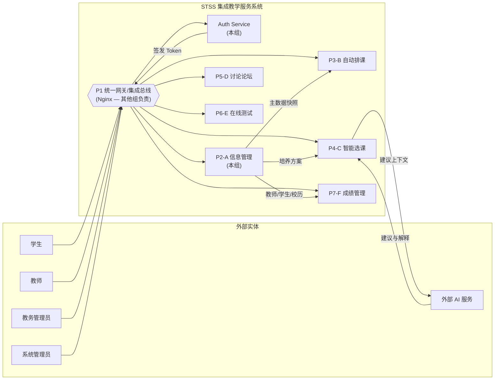
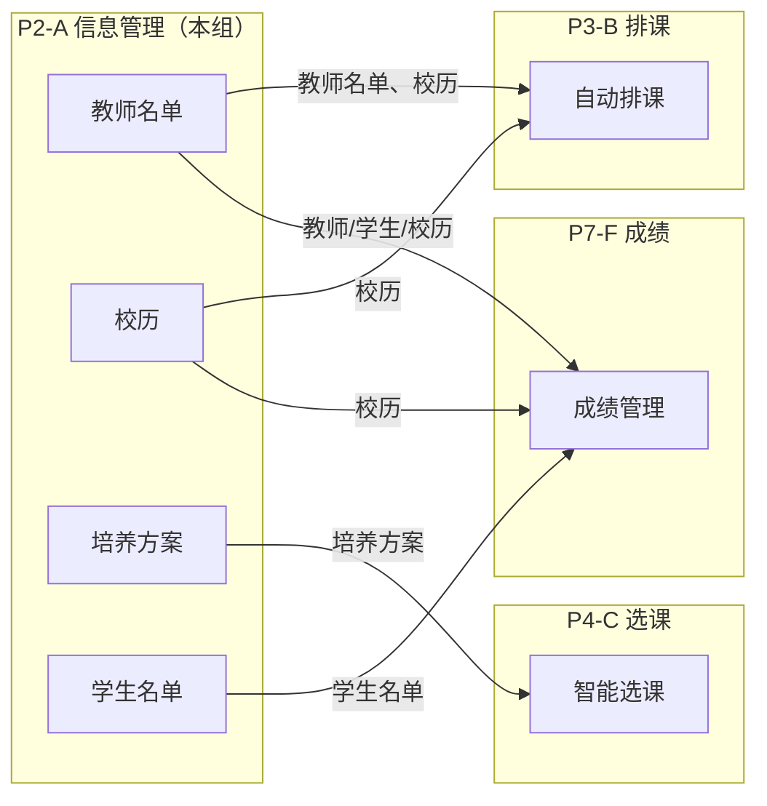
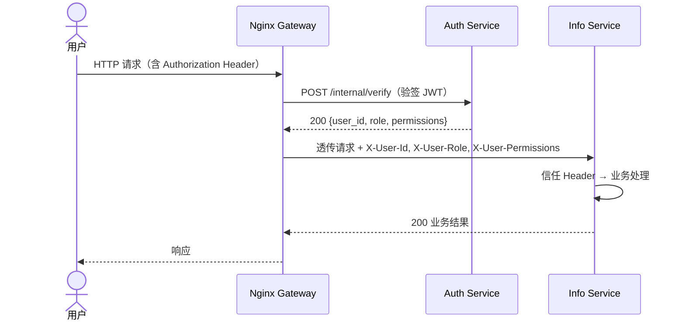

# 01 — 系统总体架构

## 1. 系统上下文

STSS（Smart Teaching Service System）是一个集成教学服务系统，由 **6 个子系统（A~F）** 通过统一网关/总线协同工作。

> **项目范围**：本项目为**纯后端**服务，包含 Auth Service 和 Info Service（P2-A 信息管理）。Gateway/Bus 由其他组负责。**不包含前端**。

> **说明**：本组仅负责 **Auth Service** 和 **Info Service（P2-A 信息管理）**。Gateway/Bus 由其他组基于 Nginx 实现，本组不实现。系统的使用者（学生、教师、管理员）通过 Gateway 接入，前端界面由其他组或独立项目负责。

## 2. 在 STSS 大组中的定位

### 2.1 角色定位

- **P2-A 信息管理**：全系统的"主数据源头"，负责用户、课程、校历、培养方案等基础数据的维护与发布。
- **Auth Service**：全系统的"认证授权中心"，负责身份认证、令牌签发、身份验证。
- 两个服务配合，向 B（排课）、C（选课）、F（成绩）提供主数据消费接口。Info Service 仅提供数据基线（baseline），选课业务逻辑由 C 系统负责。

### 2.2 主数据流

### 2.3 跨子系统通信模型

- **用户态请求**：Gateway 调用 Auth Service `/internal/verify` 完成 JWT 验签与身份提取，然后通过 `X-User-Id`、`X-User-Role`、`X-User-Permissions` Header 透传给下游服务。下游服务不再本地验签。
- **服务态请求**：系统间调用使用 Service Token（通过 `/auth/sys/login` 签发），Gateway 同样调用 Auth Service 校验并透传身份 Header。

## 3. 服务职责与边界

| 服务 | 负责方 | 端口 | 职责 |
|------|--------|------|------|
| Gateway/Bus | 其他组（Nginx） | 8000 | 统一入口、路由转发、限流、X-Request-ID 生成 |
| **Auth Service** | **本组** | 8001 | 认证、令牌签发/续期/撤销、身份提取、角色同步、权限定义 |
| **Info Service** | **本组** | 8002 | 用户管理、课程管理（含开课/排课/先修课程/教室）、基础信息、回收站、校历、培养方案、文件存储、主数据快照发布、审计日志写入 |
| 日志查询 | **本组**（Info 子模块） | — | 审计日志检索与导出，作为 Info Service 的子模块实现 |

### 3.1 服务边界原则

1. **Auth Service 不持有用户业务数据**：仅存储认证所需的最小字段（id、user_id、username、status），用户详细信息由 Info Service 管理。
2. **Info Service 不签发 Token**：所有认证相关操作统一走 Auth Service。
3. **跨服务以 userId 关联**：两个服务的数据库通过 `user_id` 逻辑关联，不建立外键约束。

## 4. 技术栈决策

### 4.1 后端

| 组件 | 选择 | 决策理由 |
|------|------|----------|
| 框架 | Python FastAPI | 异步高性能、自动 OpenAPI 文档、类型安全（Pydantic） |
| ORM | SQLModel | 与 FastAPI/Pydantic 原生适配，减少 Schema 重复定义 |
| 数据库 | SQLite（原型）→ PostgreSQL（**暂未实现**） | 原型阶段零配置部署；Model-First 模式（create_all 自动建表），生产切换时启用 Alembic |
| 缓存 | —（原型）→ Redis（**暂未实现**） | 原型阶段直接查询数据库；后续引入 Redis 缓存热点数据（见 10 号文档） |
| 迁移工具 | Alembic（生产预留） | 原型阶段使用 SQLModel.metadata.create_all()，Alembic 配置保留为模板 |
| 认证 | JWT（HS256 / RS256） | 双算法可配置；Auth 内签发与验签，密钥 via env |
| 跨服务通信 | HTTP 同步 + 补偿重试 | 原型阶段不引入 MQ，但预留事件发布接口 |
| 容器化 | Docker + Docker Compose | 环境一致性，一键启动 |
| 包管理 | uv | 快速依赖解析与安装 |
| Lint | ruff | 快速 Python linter |

### 4.2 项目范围说明

本系统为**纯后端**服务，提供 RESTful API 供 Gateway 和其他子系统调用。不包含前端界面。前端管理界面由其他组或独立前端项目负责，通过 Gateway 接入后端 API。

## 5. 关键架构决策记录（ADR）

| ID | 决策 | 理由 | 权衡 |
|----|------|------|------|
| ADR-001 | Auth DB 与 Info DB 独立 | 职责分离，独立部署 | 跨库操作需补偿机制 |
| ADR-002 | 原型用 HS256 对称密钥 | 简化部署，单密钥管理 | 多子系统扩展时需迁移至 RS256 |
| ADR-003 | 原型不引入 MQ | 降低复杂度 | 跨服务写入非实时一致 |
| ADR-004 | 项目限定为纯后端 | 需求范围调整，前端由其他组负责 | 不提供开箱即用的 UI |
| ADR-005 | SQLite 作为原型数据库 | 零配置，快速启动 | 并发写入能力有限 |
| ADR-006 | 暂缓引入 Redis 缓存 | 原型阶段数据量小，直接查询足够 | 热点数据查询效率待优化（**暂未实现**） |
| ADR-007 | 暂缓 PostgreSQL 切换 | 原型阶段 SQLite 满足需求 | 生产环境需并发与扩展能力（**暂未实现**） |

## 6. 未来演进目标

> ⚠️ 以下目标已在架构设计中预留扩展点，但**当前代码库暂未实现**。详细方案见 [10-未来演进路线图](10-future-roadmap.md)。

### 6.1 Redis 缓存层

- **目标**：引入 Redis 缓存热点数据（用户信息、角色权限、课程数据），减少数据库查询
- **预留接口**：各 Service 层预留缓存装饰器接口，CRUD 层保持无状态便于接入
- **预计影响**：Info Service 查询性能显著提升；需处理缓存失效与一致性

### 6.2 PostgreSQL 数据库切换

- **目标**：SQLite → PostgreSQL，支持并发写入和生产级性能
- **准备就绪**：Alembic 配置已保留为模板，3 条迁移链（auth/info/audit）已配置
- **切换步骤**：修改连接字符串 → 启用 Alembic → 生成初始迁移 → 运行种子脚本 → 上线
- **预计影响**：并发能力大幅提升；部署需额外 PostgreSQL 容器/实例
