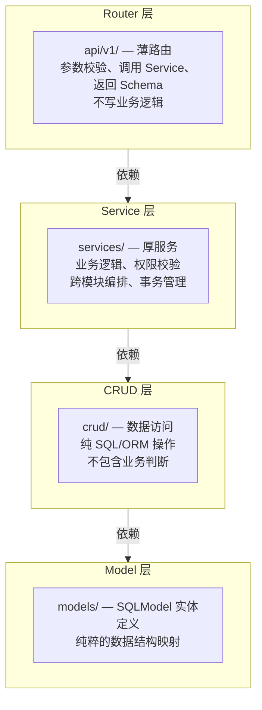
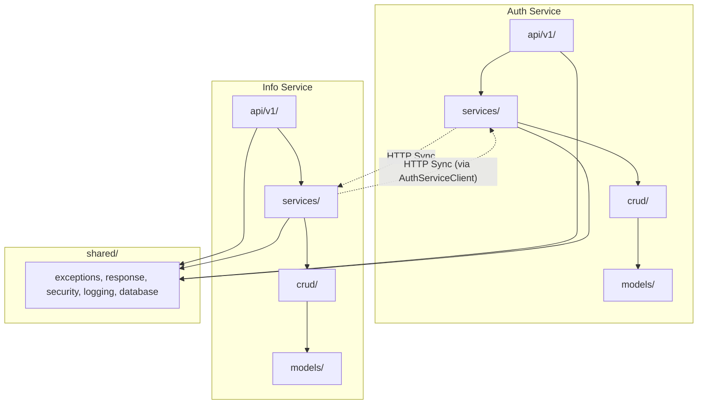

# 02 — 模块架构

## 1. 分层架构

两个服务统一采用 **Router → Service → CRUD → Model** 四层单向依赖架构，遵循 Clean Architecture 的依赖规则。



### 1.1 依赖规则

- Router → 依赖 Service（调用一个或多个 Service 方法）
- Service → 依赖 CRUD（通过 CRUD 访问数据）+ 其他 Service（编排）
- CRUD → 依赖 Model（ORM 操作）
- Model → 无依赖（纯数据结构）
- **禁止反向依赖**：CRUD 不可导入 Service，Service 不可导入 Router

### 1.2 跨层横切关注点

- `schemas/`：Pydantic 请求/响应 Schema，被 Router 和 Service 共用。
- `core/`：配置、异常定义、安全工具，所有层均可依赖。

## 2. 项目目录结构

> 以下为**实际代码库**目录结构，与 V2 设计文档的差异已修正。

```
project/
├── auth_service/
│   ├── main.py                # FastAPI 应用入口
│   ├── deps.py                # 应用级依赖（CurrentUserId、ServiceTokenPayload）
│   ├── api/
│   │   ├── deps.py            # API 层 DB session 依赖注入
│   │   └── v1/
│   │       ├── __init__.py
│   │       ├── router.py      # 聚合所有子路由 + /health
│   │       ├── auth.py        # /auth/* 端点（登录、登出、刷新、改密、me、sys/login）
│   │       └── internal.py    # /internal/* 内部端点（verify、用户CRUD、角色同步）
│   ├── services/
│   │   ├── auth_service.py    # 登录、令牌签发/续期/撤销、内部用户管理
│   │   ├── identity_service.py # Token 验签、身份提取（供 Gateway /internal/verify 调用）
│   │   └── password_policy.py # 密码复杂度策略校验（管理员/普通用户分级）
│   ├── crud/
│   │   ├── credential_crud.py # CredentialCRUD（密码读写、失败计数、锁定管理）
│   │   ├── token_crud.py      # TokenCRUD（Token 哈希存储、撤销）
│   │   ├── session_crud.py    # SessionCRUD（会话生命周期）
│   │   ├── role_crud.py       # RoleCRUD（角色分配、查询）
│   │   └── permission_crud.py # PermissionCRUD（权限点查询）
│   ├── models/
│   │   ├── user.py            # User（最小字段集）、UserStatus 枚举
│   │   ├── credential.py      # Credential（密码哈希、失败计数、锁定状态）
│   │   ├── token.py           # Token（类型枚举、哈希存储、过期时间）
│   │   ├── session.py         # AuthenticationSession（会话状态）
│   │   ├── role.py            # Role + UserRole（角色定义与用户-角色关联）
│   │   └── permission.py      # Permission + RolePermission（权限点与角色-权限关联）
│   ├── schemas/
│   │   ├── auth_schema.py     # 登录/登出/刷新/改密 请求响应
│   │   └── user_schema.py     # AuthUserResponse
│   ├── core/
│   │   ├── config.py          # AuthServiceSettings（Pydantic Settings）
│   │   ├── security.py        # JWT 签发/验签、密码哈希/验证
│   │   ├── jwt_keys.py        # JWT 密钥加载（HS256/RS256 双算法）
│   │   ├── token_hash.py      # Token SHA-256 哈希工具
│   │   ├── time_utils.py      # UTC 时间工具
│   │   └── exceptions.py      # Auth 专用异常
│   └── migrations/
│       ├── alembic.ini
│       ├── env.py
│       └── script.py.mako
│
├── info_service/
│   ├── main.py
│   ├── api/
│   │   ├── deps.py            # API 层 DB session 依赖注入
│   │   └── v1/
│   │       ├── __init__.py
│   │       ├── router.py      # 聚合所有子路由 + /health
│   │       ├── users.py       # /users/*（CRUD + 批量导入）
│   │       ├── courses.py     # /courses/*（CRUD + 先修课程管理）
│   │       ├── offerings.py   # /offerings/*
│   │       ├── schedules.py   # /schedules/*（含教师分配子资源）
│   │       ├── classrooms.py  # /classrooms/*（教室管理）
│   │       ├── calendars.py   # /calendars/*
│   │       ├── training_programs.py  # /training-programs/*
│   │       ├── base_info.py   # /base-info/*
│   │       ├── recycle_bin.py # /recycle-bin/*
│   │       ├── files.py       # /files/*
│   │       ├── audit_logs.py  # /audit-logs/*
│   │       └── data_provision.py  # /data-provision/*
│   ├── services/
│   │   ├── user_management_service.py    # 用户全生命周期（含跨服务同步）
│   │   ├── course_management_service.py  # 课程/开课/排课/教室/校历/方案/基础信息/教师分配
│   │   ├── data_provision_service.py     # 面向 B/C/F 的数据提供
│   │   ├── recycle_bin_service.py        # 回收站（跨服务协调）
│   │   ├── file_storage_service.py       # 文件上传/下载/删除
│   │   ├── audit_service.py             # 审计日志（re-export from shared）
│   │   ├── auth_client.py               # Auth 角色查询辅助函数
│   │   └── auth_http_client.py          # Auth Service HTTP 客户端（含 Token 生命周期管理）
│   ├── crud/
│   │   ├── base.py             # BaseCRUD[ModelType] 泛型基类
│   │   ├── user_crud.py        # UserInfo CRUD
│   │   ├── user_profile_crud.py # UserProfile CRUD
│   │   ├── course_crud.py      # Course CRUD（含软删除、先修课程管理）
│   │   ├── offering_crud.py    # CourseOffering CRUD
│   │   ├── schedule_crud.py    # CourseSchedule CRUD（含冲突检测）
│   │   ├── classroom_crud.py   # Classroom CRUD
│   │   ├── teacher_assignment_crud.py  # TeacherCourseAssignment CRUD
│   │   ├── calendar_crud.py    # AcademicCalendar CRUD
│   │   ├── training_program_crud.py    # TrainingProgram + TrainingProgramCourse CRUD
│   │   ├── base_info_crud.py   # BaseInfoItem CRUD
│   │   ├── file_resource_crud.py       # FileResource CRUD
│   │   └── audit_log_crud.py   # AuditLog CRUD（re-export from shared）
│   ├── models/
│   │   ├── user.py             # UserInfo
│   │   ├── user_profile.py     # UserProfile（1:1 via user_id FK）
│   │   ├── course.py           # Course（支持软删除）
│   │   ├── course_offering.py  # CourseOffering
│   │   ├── course_schedule.py  # CourseSchedule
│   │   ├── course_prerequisite.py  # CoursePrerequisite
│   │   ├── classroom.py        # Classroom
│   │   ├── teacher_assignment.py    # TeacherCourseAssignment
│   │   ├── academic_calendar.py     # AcademicCalendar
│   │   ├── training_program.py      # TrainingProgram
│   │   ├── training_program_course.py   # TrainingProgramCourse（M:N 关联）
│   │   ├── base_info_item.py   # BaseInfoItem
│   │   ├── file_resource.py    # FileResource
│   │   └── audit_log.py        # AuditLog, DeadLetterQueue, OperationLog（re-export）
│   ├── schemas/
│   │   ├── user_schema.py
│   │   ├── course_schema.py
│   │   ├── offering_schema.py
│   │   ├── schedule_schema.py
│   │   ├── classroom_schema.py
│   │   ├── calendar_schema.py
│   │   ├── training_program_schema.py
│   │   ├── base_info_schema.py
│   │   ├── file_schema.py
│   │   ├── data_provision_schema.py
│   │   ├── recycle_bin_schema.py
│   │   └── audit_log_schema.py
│   ├── deps/
│   │   └── __init__.py        # FastAPI 依赖：get_current_user、require_permission、require_admin
│   ├── core/
│   │   ├── config.py           # InfoServiceSettings
│   │   ├── security.py         # 身份 Header 读取、权限校验、资源级授权
│   │   ├── audit.py            # AuditContext 辅助类
│   │   └── exceptions.py       # 异常 re-export
│   └── migrations/
│       ├── info/               # Info 链（alembic.ini + env.py + script.py.mako）
│       └── audit/              # Audit 链（alembic.ini + env.py + script.py.mako）
│
├── shared/
│   ├── exceptions.py           # 统一异常类层次（AppError → 各子类异常）
│   ├── response.py             # 统一响应格式：APIResponse[T] / PaginatedData / ListResponse / SingleResponse
│   ├── security.py             # 身份 Header 读取、IdentityContext、权限校验装饰器
│   ├── logging.py              # AppLogger + LoggingService + RequestIDMiddleware + RequestLoggingMiddleware
│   ├── database.py             # create_get_db() 工厂、create_tables() 工具
│   ├── config.py               # SharedSettings 基类
│   ├── error_handlers.py       # register_error_handlers() — AppError → HTTP 状态码映射
│   ├── models/
│   │   └── audit_log.py        # AuditLog、DeadLetterQueue、OperationLog（Auth + Info 共享）
│   ├── crud/
│   │   └── audit_log_crud.py   # AuditLogCRUD（共享审计写入/检索）
│   └── services/
│       └── audit_service.py    # AuditService（共享审计服务）
│
├── tests/                      # 自动化测试（60+ 文件）
│   ├── conftest.py             # 根级 fixture：DB 引擎、HTTP 客户端
│   ├── utils.py                # 测试工具：身份 Header 构建、数据工厂
│   ├── test_infra.py           # 冒烟测试
│   ├── auth_service/           # Auth Service 测试（13 文件）
│   ├── info_service/           # Info Service 测试（30+ 文件）
│   ├── shared/                 # 共用库测试（4 文件）
│   └── cross_service/          # 跨服务集成测试
│
├── scripts/                    # 数据库初始化脚本
│   ├── seed_data.py            # 主入口
│   ├── seed_auth.py            # Auth 种子数据（角色、权限、管理员）
│   ├── seed_info.py            # Info 种子数据（课程、校历、教室等）
│   └── seed_utils.py           # 共享工具
│
├── docker-compose.yml
├── .env.example
└── pyproject.toml
```

## 3. Auth Service 内部模块

### 3.1 Router 层

| 端点 | 方法 | 对应 Service 方法 | 鉴权 |
|------|------|-------------------|------|
| `/auth/login` | POST | `AuthService.login()` | 无 |
| `/auth/sys/login` | POST | `AuthService.service_login()` | client_id/client_secret |
| `/auth/logout` | POST | `AuthService.logout()` | Access Token |
| `/auth/refresh` | POST | `AuthService.refresh_token()` | Refresh Token |
| `/auth/me` | GET | `AuthService.get_current_user()` | Access Token |
| `/auth/change-password` | POST | `AuthService.change_password()` | Access Token |
| `/internal/verify` | POST | `IdentityService.verify_token()` | Service Token |
| `/internal/users` | POST | `AuthService.create_internal_user()` | Service Token |
| `/internal/users/{user_id}/disable` | POST | `AuthService.disable_user()` | Service Token |
| `/internal/users/{user_id}/enable` | POST | `AuthService.enable_user()` | Service Token |
| `/internal/users/{user_id}/roles` | POST | `AuthService.sync_user_roles()` | Service Token |
| `/internal/users/roles/batch` | POST | `AuthService.batch_get_user_roles()` | Service Token |
| `/internal/users/{user_id}` | DELETE | `AuthService.delete_user()` | Service Token |

### 3.2 Service 层

**AuthService** — 核心认证逻辑：
- `login(username, password)` → 验证凭据 → 签发 Access + Refresh Token → 创建会话
- `service_login(client_id, client_secret)` → 验证服务身份 → 签发 Service Token
- `logout(session_id)` → 撤销 Refresh Token
- `refresh_token(refresh_token)` → 验证 → 签发新 Token 对
- `change_password(user_id, old_pw, new_pw)` → 验证旧密码 → 更新哈希
- `create_internal_user(user_id, username, role_ids)` → 创建 credentials + 分配角色
- `disable_user(user_id)` → 设置 status=DISABLED + 锁定凭据
- `enable_user(user_id)` → 设置 status=ACTIVE + 解锁凭据
- `sync_user_roles(user_id, role_ids)` → 替换用户全部角色
- `batch_get_user_roles(user_ids)` → 批量查询用户角色
- `delete_user(user_id)` → 物理删除所有认证数据
- 登录保护：连续失败 5 次 → 锁定 10 分钟

**IdentityService** — 身份验证（供 Gateway 调用）：
- 验签 JWT（Access Token / Service Token）
- 提取 `sub`（user_id）、`role`、`permissions`
- 通过 `/internal/verify` 端点暴露，仅内网可达

**PasswordPolicy**（独立函数模块）：
- `validate_new_password(password, role_codes)` → 管理员密码需 10 位+大小写+数字+特殊字符，普通用户 8 位+字母数字

### 3.3 CRUD 层

| CRUD 模块 | 操作模型 | 职责 |
|-----------|----------|------|
| CredentialCRUD | Credential | 密码哈希读写、失败计数、锁定状态 |
| TokenCRUD | Token | Token 持久化（SHA-256 哈希）、撤销标记 |
| SessionCRUD | AuthenticationSession | 会话生命周期管理 |
| RoleCRUD | Role, UserRole | 角色与用户-角色映射 |
| PermissionCRUD | Permission, RolePermission | 权限点定义与角色-权限映射 |

> **注意**：Auth Service 不设独立的 `UserCRUD`。User 表的操作（查询、状态变更、删除）直接在 `AuthService` 中通过 `db.exec(select(...))` 执行，逻辑简单不必要抽象单独的 CRUD 类。

### 3.4 Model 层

| 模型 | 核心字段 |
|------|----------|
| User（最小集） | id, user_id, username, status(ACTIVE/DISABLED), created_at |
| Credential | id, user_id, username, password_hash, password_salt, failed_login_count, locked_until, created_at, updated_at |
| Token | id, user_id, type(ACCESS/REFRESH/SERVICE), token_hash(SHA-256), issued_at, expires_at, revoked_at |
| AuthenticationSession | id, user_id, access_token_id(FK→tokens), refresh_token_id(FK→tokens), status(ACTIVE/ENDED/EXPIRED), client_ip, created_at, ended_at |
| Role | id, code, name, description, is_active, created_at |
| Permission | id, code(resource:action), name, resource, action, created_at |
| UserRole | id, user_id, role_id(FK→roles), UniqueConstraint(user_id, role_id) |
| RolePermission | id, role_id(FK→roles), permission_id(FK→permissions), UniqueConstraint(role_id, permission_id) |

## 4. Info Service 内部模块

### 4.1 Service 层

**UserManagementService** — 用户全生命周期：
- `create_user()` → 写 Info DB → HTTP 调用 Auth Service → 补偿删除
- `update_user()` / `patch_user()` / `disable_user()` / `enable_user()`
- `logical_delete_user()` → 标记 isDeleted → HTTP 禁用 Auth 账号
- `batch_import_users()` → CSV 解析 → 逐条创建 → 汇总结果
- 角色管理由 Auth Service 独立负责，Info Service 通过 `batch_fetch_role_names()` 按需查询角色信息用于展示

**CourseManagementService** — 课程与教学资源：
- 课程 CRUD（含软删除）、先修课程管理（添加/删除/列表）
- 开课 CRUD、排课 CRUD（含冲突检测）
- 教室 CRUD、教师分配管理
- 校历管理、培养方案管理、基础信息条目管理
- 批量查询辅助：`batch_get_courses()`、`batch_get_offerings()`、`batch_get_classrooms()`、`batch_get_teacher_names()`

**DataProvisionService** — 面向 B/C/F 的数据提供：
- `list_teachers()` / `list_candidate_students()` / `get_calendars()`
- `list_training_programs()` / `resolve_training_program_version()`
- 返回结果附加 `snapshotTime` / `version`

**RecycleBinService** — 回收站：
- `list_deleted_users()` / `restore_user()` — 含跨服务 Auth 协调
- `physical_delete_user()` / `batch_physical_delete()`

**FileStorageService** — 文件管理：
- `upload_file()` → 校验类型/大小 → 异步落盘 → 写元数据（含 SHA-256 checksum）
- `delete_file()` / `get_file()` / `generate_access_url()`

**AuthServiceClient**（auth_http_client.py） — Auth 跨服务通信：
- 管理 Service Token 生命周期（获取、缓存、80% 过期自动刷新）
- 封装 `POST /internal/*` 和 `DELETE /internal/*` 调用

**AuditService**（shared/services/） — 审计日志：
- `write_audit_log()` — 高风险操作记录（Auth + Info 共享写入）
- `search_audit_logs()` / `export_audit_logs()`

### 4.2 CRUD 层

| CRUD 模块 | 对应模型 | 职责 |
|-----------|----------|------|
| UserCRUD | UserInfo | 用户主表操作（自定义实现） |
| UserProfileCRUD | UserProfile | 档案管理（自定义实现，含 JOIN UserInfo） |
| CourseCRUD (BaseCRUD) | Course | 课程主数据 + 先修课程管理 |
| OfferingCRUD (BaseCRUD) | CourseOffering | 开课实例 |
| ScheduleCRUD (BaseCRUD) | CourseSchedule | 排课记录（含冲突检测） |
| ClassroomCRUD (BaseCRUD) | Classroom | 教室资源 |
| TeacherAssignmentCRUD (BaseCRUD) | TeacherCourseAssignment | 教师分配 |
| CalendarCRUD (BaseCRUD) | AcademicCalendar | 校历数据 |
| TrainingProgramCRUD (BaseCRUD) | TrainingProgram, TrainingProgramCourse | 培养方案 + 关联课程 |
| BaseInfoCRUD (BaseCRUD) | BaseInfoItem | 通用基础信息 |
| FileResourceCRUD (BaseCRUD) | FileResource | 文件元数据 |
| AuditLogCRUD | AuditLog, DeadLetterQueue, OperationLog | 审计日志读写（shared） |

> **BaseCRUD[ModelType]** 提供通用方法：`get()`、`get_multi()`、`create()`、`update()`、`delete()`。各领域 CRUD 继承基类并添加领域特定查询方法。

## 5. 共享模块（shared/）

`shared/` 目录存放两个服务共用的代码，避免重复：

| 模块 | 内容 |
|------|------|
| `exceptions.py` | 统一异常类层次：`AppError` → `AuthenticationError`、`AuthorizationError`、`ResourceNotFoundError`、`BusinessRuleError`、`ExternalServiceError`、`AccountLockedError`、`AccountDisabledError`、`TokenExpiredError`、`ServiceCredentialInvalidError`、`MissingIdentityHeaderError` |
| `response.py` | 统一响应格式：`APIResponse[T]`、`PaginatedData`、`ListResponse[T]`、`SingleResponse[T]` |
| `security.py` | 身份 Header 读取（`X-User-Id`、`X-User-Role`、`X-User-Permissions`）、`IdentityContext` 类、权限校验装饰器 `require_permission` |
| `database.py` | DB session 工厂 `create_get_db(engine)`、`create_tables()` 工具函数 |
| `config.py` | `SharedSettings` 基类（env、CORS、日志配置） |
| `logging.py` | `AppLogger`（JSON 格式、四级日志、X-Request-ID 自动注入）、`LoggingService`、`RequestIDMiddleware`、`RequestLoggingMiddleware` |
| `error_handlers.py` | `register_error_handlers()` — AppError 子类到 HTTP 状态码的映射注册 |
| `models/audit_log.py` | 审计日志模型：`AuditLog`、`DeadLetterQueue`、`OperationLog`（Auth + Info 共享） |
| `crud/audit_log_crud.py` | 审计日志 CRUD：`write()`、`search()` |
| `services/audit_service.py` | 审计服务：`write_audit_log()`、`search_audit_logs()`、`export_audit_logs()` |

> **注意**：`shared/security.py` 处理的是 Gateway 透传的**身份 Header 读取与权限校验**，而非 JWT 加解密。JWT 签发/验签逻辑全部在 `auth_service/core/security.py`、`auth_service/core/jwt_keys.py`、`auth_service/core/token_hash.py` 中。

## 6. 模块间依赖关系



> 虚线表示跨服务 HTTP 调用，非代码级依赖。Info Service 通过 `AuthServiceClient`（含 Service Token 生命周期管理）调用 Auth Service 内部端点。
