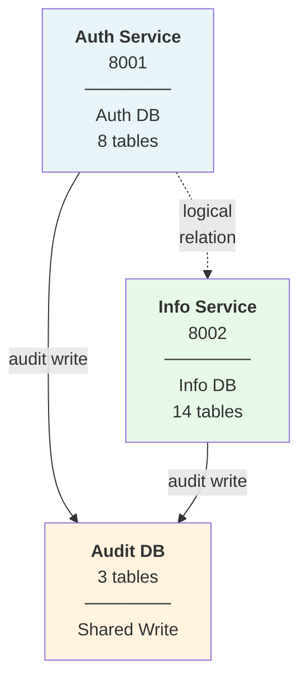
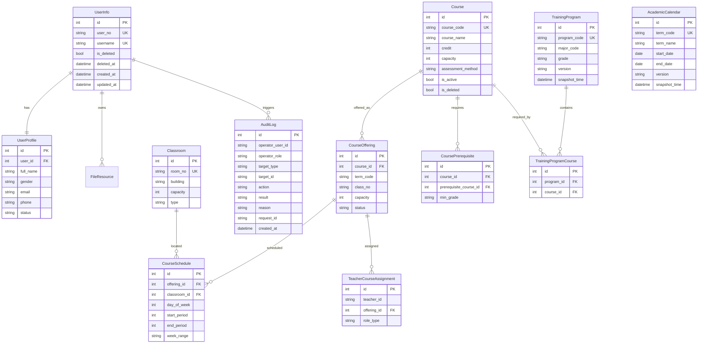
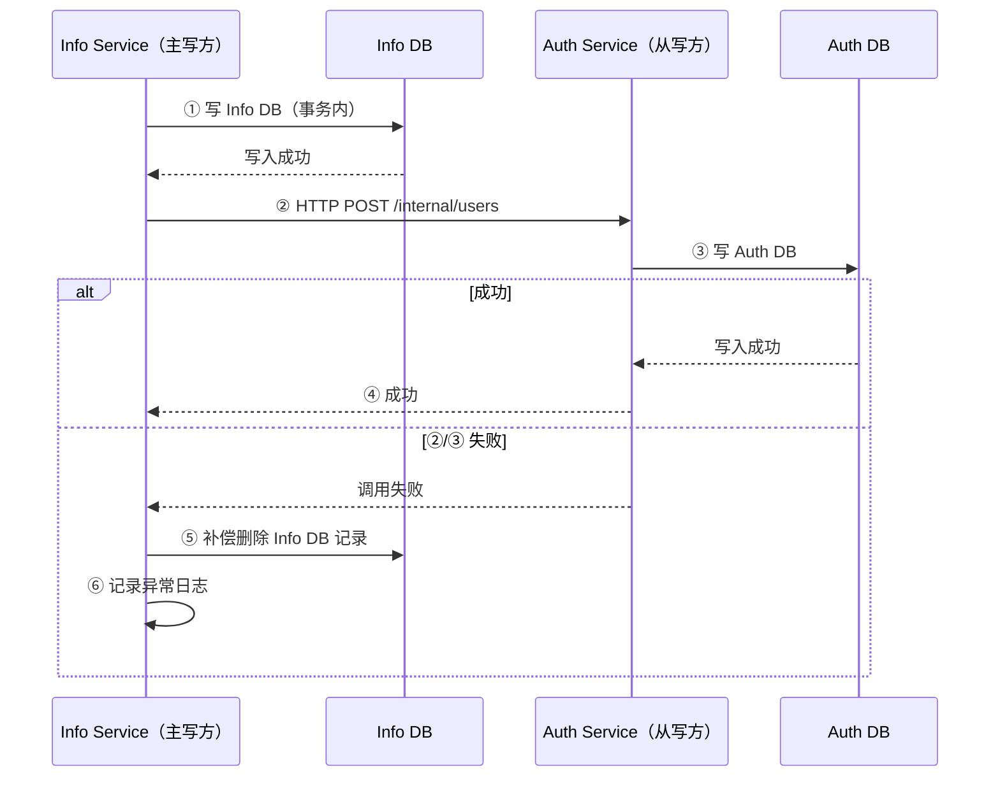

# 03 — 数据架构

## 1. 数据库分库设计

系统使用 **3 个独立 SQLite 数据库**，分别服务于认证、业务和审计日志。



> **端口与所有权**：Auth Service（8001）独占 Auth DB；Info Service（8002）独占 Info DB；Audit DB 由 Auth + Info Service 共享写入（8001 + 8002）。

### 1.1 分库原则

- **Auth DB**：仅存认证授权相关数据，由 Auth Service 独占。
- **Info DB**：存全部业务主数据，由 Info Service 独占。
- **Audit DB**：存审计日志与操作日志，与业务数据物理隔离，满足审计独立存储要求。由 Auth Service 和 Info Service 共享写入，两个服务各自启动独立的 audit.db 引擎，共享同一个 audit.db 文件。
- **跨库关联**：通过 `user_id` 字符串逻辑关联（Auth 的 `users.user_id` ↔ Info 的 UserInfo 通过 `user_no`、`username` 等业务标识关联），不建立数据库级外键。

### 1.2 各库表清单

#### Auth DB（auth.db — 8 表）

| 表名 | SQLModel 类 | 职责 | 关键字段 |
|------|-------------|------|----------|
| `users` | `User` | 最小用户标识 | id, user_id(UK), username(UK), status, created_at |
| `credentials` | `Credential` | 认证凭据 | id, user_id(UK), username, password_hash, password_salt, failed_login_count, locked_until |
| `tokens` | `Token` | Token 记录 | id, user_id, type(ACCESS/REFRESH/SERVICE), token_hash(UK, SHA-256), issued_at, expires_at, revoked_at |
| `authentication_sessions` | `AuthenticationSession` | 登录会话 | id, user_id, access_token_id(FK→tokens), refresh_token_id(FK→tokens), status(ACTIVE/ENDED/EXPIRED), client_ip |
| `roles` | `Role` | 角色定义 | id, code(UK), name, description, is_active |
| `permissions` | `Permission` | 权限点定义 | id, code(UK, resource:action), name, resource, action |
| `user_roles` | `UserRole` | 用户-角色关联 | id, user_id, role_id(FK→roles), UniqueConstraint(user_id, role_id) |
| `role_permissions` | `RolePermission` | 角色-权限关联 | id, role_id(FK→roles), permission_id(FK→permissions), UniqueConstraint(role_id, permission_id) |

#### Info DB（info.db — 14 表）

| 域 | 表名 | SQLModel 类 | 关键字段 |
|----|------|-------------|----------|
| 用户 | `users_info` | `UserInfo` | id, user_no(UK), username(UK), is_deleted, deleted_at, created_at, updated_at |
| 用户 | `user_profiles` | `UserProfile` | id, user_id(FK→users_info.id, UK), full_name, gender, email, phone, status, avatar_file_id |
| 课程 | `courses` | `Course` | id, course_code(UK), course_name, credit, capacity, assessment_method, is_active, is_deleted |
| 课程 | `course_offerings` | `CourseOffering` | id, course_id(FK→courses), term_code, class_no, capacity, status; UniqueConstraint(course_id, term_code, class_no) |
| 课程 | `course_schedules` | `CourseSchedule` | id, offering_id(FK→course_offerings), classroom_id(FK→classrooms), day_of_week(1-7), start_period, end_period, week_range |
| 课程 | `course_prerequisites` | `CoursePrerequisite` | id, course_id(FK→courses), prerequisite_course_id(FK→courses), min_grade; UniqueConstraint(course_id, prerequisite_course_id) |
| 教学 | `classrooms` | `Classroom` | id, room_no(UK), building, capacity, type |
| 教学 | `teacher_course_assignments` | `TeacherCourseAssignment` | id, teacher_id, offering_id(FK→course_offerings), role_type; UniqueConstraint(offering_id, teacher_id, role_type) |
| 教学 | `training_program_courses` | `TrainingProgramCourse` | id, program_id(FK→training_programs), course_id(FK→courses); UniqueConstraint(program_id, course_id) |
| 基础 | `academic_calendars` | `AcademicCalendar` | id, term_code(UK), term_name, start_date, end_date, version, snapshot_time |
| 基础 | `training_programs` | `TrainingProgram` | id, program_code(UK), major_code, grade, version, snapshot_time |
| 基础 | `base_info_items` | `BaseInfoItem` | id, category, item_code, item_name, description, is_active; UniqueConstraint(category, item_code) |
| 文件 | `file_resources` | `FileResource` | id, owner_user_id, file_name, file_type, file_size, storage_path, checksum(SHA-256) |

#### Audit DB（audit.db — 3 表，定义在 shared/models/）

| 表名 | SQLModel 类 | 关键字段 |
|------|-------------|----------|
| `audit_logs` | `AuditLog` | id, operator_user_id, operator_role, target_type, target_id, action, result, reason, request_id, created_at |
| `dead_letter_queue` | `DeadLetterQueue` | id, target_service, operation, payload, error_message, retry_count, max_retries, created_at, last_retry_at |
| `operation_logs` | `OperationLog` | id, caller_id, query_condition, snapshot_version, created_at |

## 2. 实体关系图（ER）



> 注：Auth DB 中的 User、Credential、Token、Role、Permission 等表通过 `user_id` 字符串与 Info DB 逻辑关联，不在 ER 图中重复绘制。

## 3. 跨库数据一致性

### 3.1 一致性策略

原型阶段采用 **HTTP 同步调用 + 补偿重试** 模式：



### 3.2 场景覆盖

| 场景 | 主操作（Info） | 同步操作（Auth） | 补偿动作 |
|------|---------------|-----------------|----------|
| 用户创建 | 写 users_info + user_profiles | POST /internal/users（创建 credentials + 角色分配） | 补偿删除 Info 记录 |
| 逻辑删除 | 标记 isDeleted=true | POST /internal/users/{id}/disable 禁用账号 | Info 清除 isDeleted |
| 恢复用户 | 清除 isDeleted | POST /internal/users/{id}/enable 启用账号 | Info 重新标记 isDeleted |
| 物理删除 | DELETE users_info + profiles | DELETE /internal/users/{id} 清理认证数据 | 记录失败日志，人工介入 |
| 批量导入 | 逐条 Info 建档 | 逐条创建 Auth 账号 | 汇总失败明细，不补偿已成功的 |
| 角色同步 | — | POST /internal/users/{id}/roles 替换角色 | 记录失败日志 |

### 3.3 异常处理

- 所有 HTTP 同步调用失败时：记录 ERROR 日志（含完整请求上下文）。
- 补偿操作本身失败时：写入 `dead_letter_queue` 表（Audit DB），支持后续人工或自动重试。
- 补偿失败不影响已有成功数据，宁可保留未同步状态也不丢失主数据。

## 4. 数据迁移管理

### 4.1 Model-First 模式（原型阶段）

原型阶段采用 **Model-First** 模式：SQLModel 模型定义即为数据库 schema 的唯一真实来源，应用启动时通过 `SQLModel.metadata.create_all()` 自动建表。

- **无迁移文件**：原型阶段不维护 Alembic migration chain，快速迭代模型定义。
- **Alembic 配置保留**：`alembic.ini` 和 `env.py` 作为模板保留，生产切换时可随时启用。
- **建表时机**：FastAPI lifespan 中调用 `create_all()`，确保所有注册模型对应的表已创建。
- **表注册**：每个服务的 `models/__init__.py` 导入所有模型模块，确保 `SQLModel.metadata` 包含完整表集合。

### 4.2 生产演进路径

- SQLite → PostgreSQL 切换时：修改连接字符串 → 启用 Alembic → 生成初始迁移 → 后续增量迁移。
- Alembic 配置结构（保留作为模板）：

```
auth_service/migrations/    # Auth 链（alembic.ini + env.py）
info_service/migrations/
├── info/                   # Info 链（alembic.ini + env.py）
└── audit/                  # Audit 链（alembic.ini + env.py）
```

> **未来演进**：PostgreSQL 切换方案详见 [10-未来演进路线图](10-future-roadmap.md)（**暂未实现**）。

### 4.3 索引策略

原型阶段建立以下索引（SQLite 自动为主键和 UNIQUE 约束创建索引）：

| 表 | 索引字段 | 用途 |
|----|----------|------|
| users_info | username, user_no | 登录查询、学号查询 |
| user_profiles | user_id | 档案关联 |
| courses | course_code, is_active | 课程检索 |
| course_offerings | course_id, term_code | 开课查询 |
| course_offerings | (course_id, term_code, class_no) UNIQUE | 防重复开课 |
| course_schedules | offering_id, classroom_id | 排课关联查询 |
| course_prerequisites | course_id, prerequisite_course_id | 先修课程查询 |
| course_prerequisites | (course_id, prerequisite_course_id) UNIQUE | 防重复先修关系 |
| classrooms | room_no | 教室查询 |
| teacher_course_assignments | teacher_id, offering_id | 教师分配查询 |
| teacher_course_assignments | (offering_id, teacher_id, role_type) UNIQUE | 防重复分配 |
| training_program_courses | program_id, course_id | 方案课程查询 |
| training_program_courses | (program_id, course_id) UNIQUE | 防重复关联 |
| base_info_items | category | 基础信息分类查询 |
| base_info_items | (category, item_code) UNIQUE | 防重复条目 |
| training_programs | program_code, major_code | 方案检索 |
| audit_logs | operator_user_id, target_type, action, created_at | 审计检索 |
| dead_letter_queue | target_service, retry_count | 死信队列查询 |
| authentication_sessions | user_id, access_token_id, refresh_token_id | 会话关联查询 |
| tokens | user_id, token_hash | Token 查询 |
| credentials | user_id, username | 凭据查询 |
| user_roles | user_id, role_id | 用户角色查询 |
| role_permissions | role_id, permission_id | 角色权限查询 |
