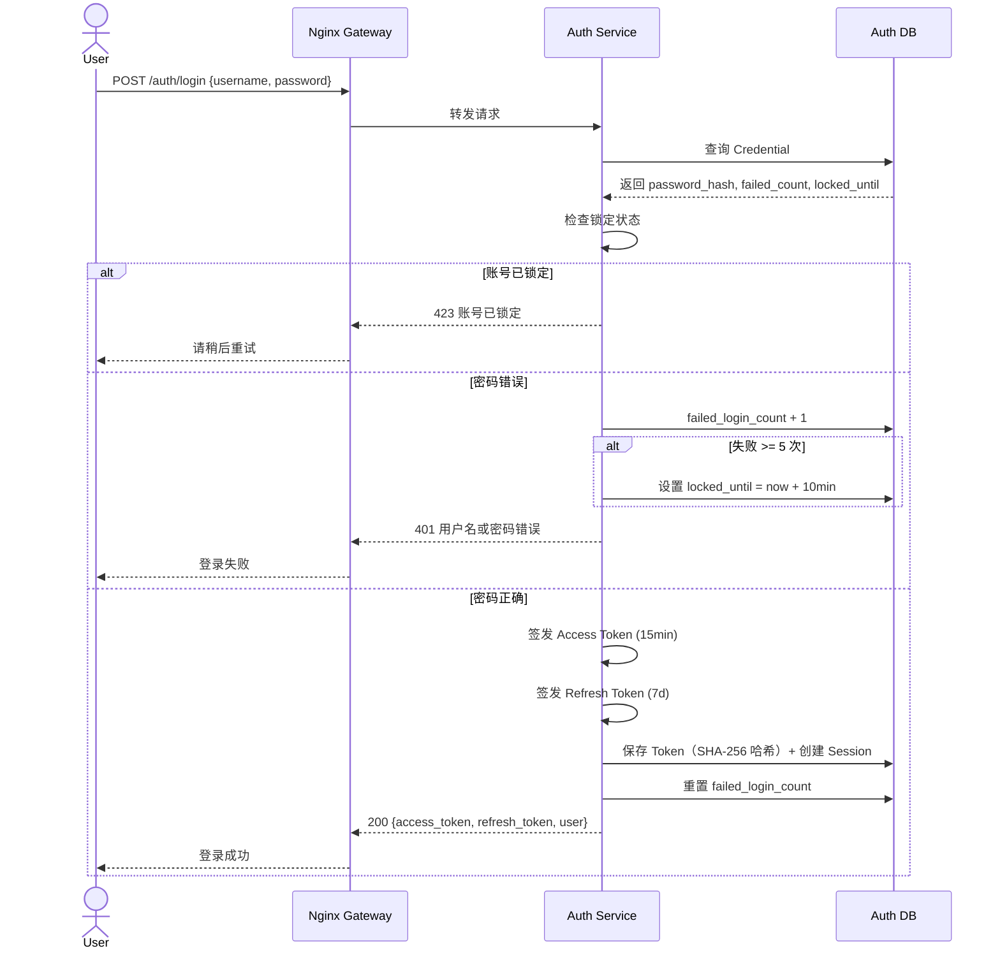
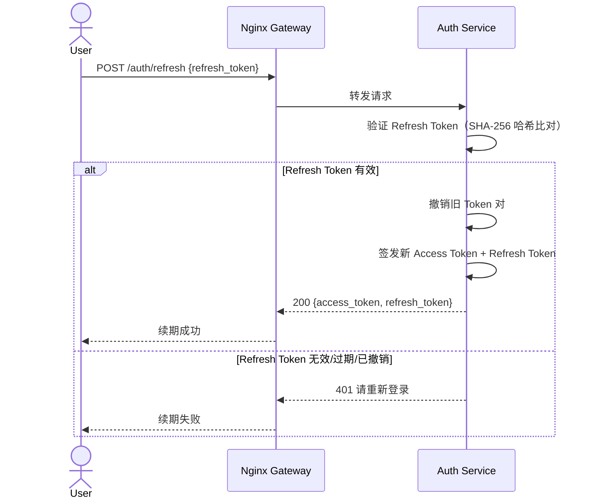
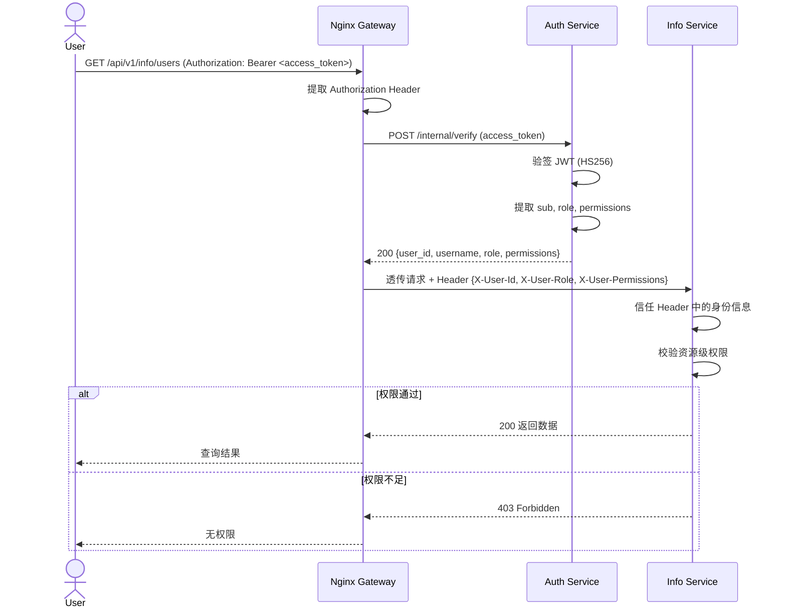
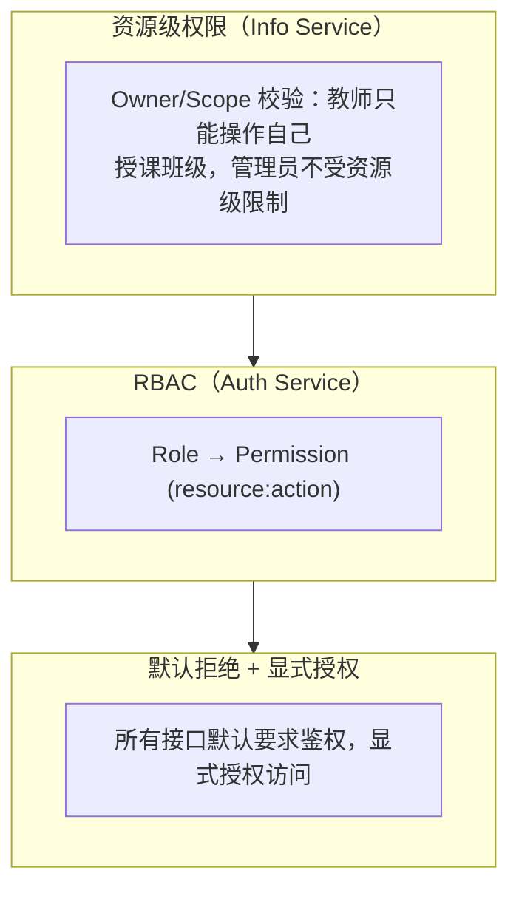
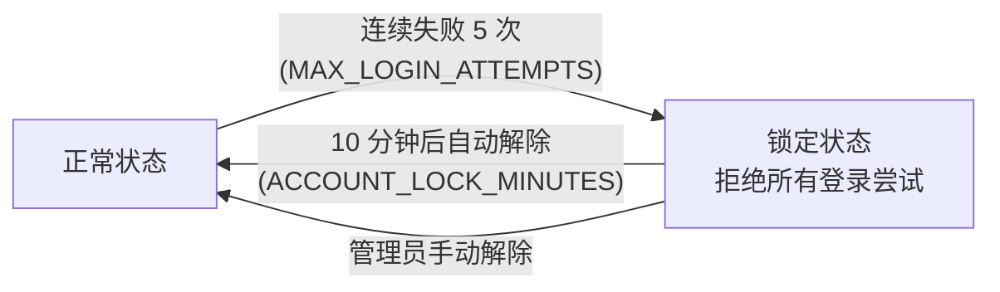

# 04 — 安全架构

## 1. 认证流程

### 1.1 用户登录流程



### 1.2 Token 续期流程



### 1.3 后续请求鉴权链路

Gateway 负责统一鉴权：收到请求后调用 Auth Service 验证 JWT 并提取身份，然后将身份信息通过 HTTP Header 透传给下游服务。Info Service 信任 Gateway 透传的身份 Header，不再本地验签。



> **关键设计决策**：Gateway 统一完成 JWT 验签与身份提取，下游服务（Info Service）不再持有 JWT 密钥，不重复验签。这降低了密钥分发面，简化了下游服务的鉴权逻辑。Auth Service 通过 `/internal/verify` 端点（内部网络可达）为 Gateway 提供身份验证服务。

### 1.4 登出流程

- 用户调用 `POST /auth/logout` → Auth Service 撤销 Refresh Token，结束会话。
- Access Token 不主动撤销（原型阶段不设黑名单），依赖短期自然过期（15 分钟）。
- 客户端清除本地 Token 存储。

## 2. 授权模型

### 2.1 RBAC + 资源级权限（混合模型）



### 2.2 角色定义

| 角色 | Code | 说明 |
|------|------|------|
| 学生 | STUDENT | 查看个人信息、查看课程 |
| 教师 | TEACHER | 查看个人信息、管理授课班级 |
| 教务管理员 | ACADEMIC_ADMIN | 管理用户、课程、校历、基础信息 |
| 系统管理员 | SYS_ADMIN | 最高权限，含角色分配、系统配置、审计日志查询 |

### 2.3 权限点编码规范

采用 `resource:action` 格式（kebab-case）：

| 资源 | 权限点 |
|------|--------|
| user | `user:read`, `user:create`, `user:update`, `user:delete` |
| course | `course:read`, `course:create`, `course:update`, `course:delete` |
| offering | `offering:read`, `offering:create`, `offering:update`, `offering:delete` |
| schedule | `schedule:read`, `schedule:create`, `schedule:update`, `schedule:delete` |
| calendar | `calendar:read`, `calendar:create`, `calendar:update`, `calendar:delete` |
| training | `training:read`, `training:create`, `training:update`, `training:delete` |
| base-info | `base-info:read`, `base-info:create`, `base-info:update`, `base-info:delete` |
| classroom | `classroom:read`, `classroom:create`, `classroom:update`, `classroom:delete` |
| file | `file:read`, `file:create`, `file:delete` |
| data-provision | `data-provision:read` |
| audit | `audit:read` |
| recycle | `recycle:read`, `recycle:restore`, `recycle:delete` |
| role | `role:read`, `role:assign` |
| permission | `permission:read` |

### 2.4 角色-权限映射

> **说明**：`(self)` = 资源级校验允许用户操作自己的数据（如 `check_resource_access(owner=user_id)`）；`(assigned)` = 教师仅可操作被分配到的开课/排课（如 `_check_offering_access(teacher_ids)`）。

| 权限点 | STUDENT | TEACHER | ACADEMIC_ADMIN | SYS_ADMIN |
|--------|---------|---------|----------------|-----------|
| user:read (self) | ✓ | ✓ | — | — |
| user:read (all) | — | — | ✓ | ✓ |
| user:update (self) | ✓ | ✓ | — | — |
| user:update (all) | — | — | ✓ | ✓ |
| user:create | — | — | ✓ | ✓ |
| user:delete | — | — | ✓ | ✓ |
| course:read | ✓ | ✓ | ✓ | ✓ |
| course:create/update/delete | — | — | ✓ | ✓ |
| offering:read | ✓ | ✓ | ✓ | ✓ |
| offering:create | — | — | ✓ | ✓ |
| offering:update/delete (assigned) | — | ✓ | ✓ | ✓ |
| schedule:read | ✓ | ✓ | ✓ | ✓ |
| schedule:create | — | — | ✓ | ✓ |
| schedule:update/delete (assigned) | — | ✓ | ✓ | ✓ |
| calendar:read | ✓ | ✓ | ✓ | ✓ |
| calendar:create/update/delete | — | — | ✓ | ✓ |
| training:read | ✓ | ✓ | ✓ | ✓ |
| training:create/update/delete | — | — | ✓ | ✓ |
| base-info:read | ✓ | ✓ | ✓ | ✓ |
| base-info:create/update/delete | — | — | ✓ | ✓ |
| classroom:read | ✓ | ✓ | ✓ | ✓ |
| classroom:create/update/delete | — | — | ✓ | ✓ |
| file:read | ✓ | ✓ | ✓ | ✓ |
| file:create | ✓ | ✓ | ✓ | ✓ |
| file:delete | ✓ | ✓ | ✓ | ✓ |
| data-provision:read | — | — | ✓ | ✓ |
| audit:read | — | — | — | ✓ |
| recycle:* | — | — | ✓ | ✓ |
| role:read | — | — | — | ✓ |
| role:assign | — | — | — | ✓ |
| permission:read | — | — | — | ✓ |

### 2.5 资源级权限校验规则

| 规则 | 适用角色 | 校验逻辑 |
|------|----------|----------|
| 教师只能操作自己的授课 | TEACHER | 查询 `teacher_course_assignments` 表，校验当前 userId 是否已分配到此开课 |
| 用户只能编辑自己的信息 | ALL | `user_id == current_user_id` |
| 管理员不受资源级限制 | ACADEMIC_ADMIN, SYS_ADMIN | 跳过资源级校验 |

## 3. JWT 密钥管理

### 3.1 双算法支持（HS256 / RS256）

```python
# 配置项
JWT_SUPPORT_HS256 = True
JWT_SUPPORT_RS256 = False  # 暂未启用
JWT_SIGNING_ALGORITHM = "HS256"
TOKEN_SECRET_KEY = env("TOKEN_SECRET_KEY")
JWT_HS256_KEY_ID = "auth-hs256-key-1"
ACCESS_TOKEN_EXPIRE_MINUTES = 15  # 普通用户
ADMIN_ACCESS_TOKEN_EXPIRE_MINUTES = 5  # 管理员（更短）
REFRESH_TOKEN_EXPIRE_DAYS = 7
SERVICE_TOKEN_EXPIRE_HOURS = 8  # Service Token
```

### 3.2 Token Payload 结构

**Access Token**：
```json
{
  "sub": "user_id",
  "jti": "uuid",
  "type": "access",
  "role": "STUDENT",
  "iat": 1648300800,
  "exp": 1648301700
}
```

**Service Token**（系统间调用）：
```json
{
  "sub": "service_b",
  "jti": "uuid",
  "type": "service",
  "client_id": "course_arrangement",
  "scope": "teacher:read calendar:read",
  "aud": "info_service",
  "iat": 1648300800,
  "exp": 1648329600
}
```

### 3.3 密钥与 JWT 算法

Auth Service 在内部完成 **签发与验签**；Gateway/下游**不持有 JWT 密钥**。

| 变量 | 说明 |
|------|------|
| `JWT_SUPPORT_HS256` | 是否接受 HS256 Token（验签） |
| `JWT_SUPPORT_RS256` | 是否接受 RS256 Token（验签） |
| `JWT_SIGNING_ALGORITHM` | 新签发 Token 使用的算法（须在 SUPPORT 列表中） |
| `TOKEN_SECRET_KEY` | HS256 对称密钥 |
| `JWT_RSA_*_PEM` | RS256 密钥对（私钥签发，公钥验签） |

两种算法密钥可同时配置，便于 HS256 → RS256 迁移：双开 SUPPORT 后，旧 HS256 Token 在过期前仍可验签。

**Token 持久化**：`tokens.token_hash` 仅存 SHA-256 摘要，不存 JWT 明文。

换密钥：更新环境变量并重启服务；不做在线 JWKS 轮换。

### 3.4 鉴权职责分配

**Gateway 统一鉴权**：Gateway 是唯一的 JWT 验签点，通过调用 Auth Service 的 `/internal/verify` 端点完成 Token 验证与身份提取。下游服务（Info Service 及其他业务子系统）信任 Gateway 透传的身份 Header，不持有 JWT 密钥，不重复验签。

| 职责 | Gateway | Auth Service | Info Service |
|------|---------|-------------|-------------|
| JWT 验签 (HS256/RS256) | —（调用 Auth） | ✓ | — |
| Token 身份提取 | —（调用 Auth） | ✓ | — |
| 透传身份 Header | ✓ | — | — |
| 读取身份 Header | — | — | ✓ |
| 权限校验 | — | — | ✓ |

**透传 Header 规范**：

| Header | 来源 | 说明 |
|--------|------|------|
| `X-User-Id` | Auth Service 返回 | 用户唯一标识 |
| `X-User-Role` | Auth Service 返回 | 用户当前角色 |
| `X-User-Permissions` | Auth Service 返回 | 逗号分隔的权限点列表 |
| `X-Request-ID` | Gateway 生成 | 全链路追踪 ID |

> **安全边界**：Gateway 是信任边界。下游服务仅接受来自 Gateway（内网）的请求，不直接暴露于外部网络。Auth Service 的 `/internal/*` 端点仅内网可达。

## 4. 内部端点鉴权

### 4.1 Internal 端点清单

| 端点 | 方法 | 用途 | 调用方 |
|------|------|------|--------|
| `/internal/verify` | POST | 验证 Token，返回身份信息 | Gateway |
| `/internal/users` | POST | 创建 Auth 用户 + 凭据 + 角色 | Info Service |
| `/internal/users/{user_id}/disable` | POST | 禁用用户（设置 DISABLED） | Info Service |
| `/internal/users/{user_id}/enable` | POST | 启用用户（设置 ACTIVE） | Info Service |
| `/internal/users/{user_id}/roles` | POST | 同步用户角色（替换全部） | Info Service |
| `/internal/users/roles/batch` | POST | 批量查询用户角色 | Info Service |
| `/internal/users/{user_id}` | DELETE | 物理删除用户所有认证数据 | Info Service |

> 所有 `/internal/*` 端点由 `ServiceTokenPayload` 依赖保护，仅接受有效的 Service Token。

## 5. 安全防护措施

### 5.1 密码安全

- 密码使用 **bcrypt** 带盐哈希（cost factor = 12）。
- 管理员密码复杂度要求：最少 10 位，含大小写字母、数字、特殊字符。
- 普通用户密码复杂度：最少 8 位，含字母和数字。
- 密码变更时不记录明文，审计日志仅记录"密码已变更"事件。

### 5.2 登录保护



### 5.3 接口保护

| 措施 | 说明 |
|------|------|
| Gateway 统一鉴权 | 所有 `/api/v1/*` 请求由 Gateway 统一验证 JWT，下游服务仅接受内网请求 |
| 显式授权 | 每个端点声明所需权限点，无声明 = 默认拒绝 |
| 内网隔离 | Info Service 仅监听内网地址或通过 Docker 内部网络通信，不对外暴露端口 |
| CORS | 配置 CORS 白名单，仅允许已知域名 |

### 5.4 敏感操作审计

以下操作必须写入审计日志：
- 用户创建 / 删除（含批量）
- 权限/角色调整
- 密码重置
- 物理删除（回收站）
- 批量导入
- 数据提供接口调用（记录调用方 + 查询条件）
