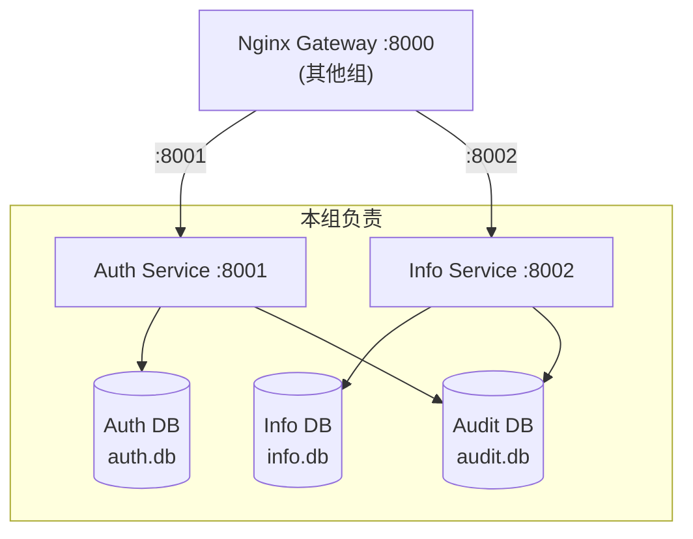

# 08 — 部署架构

## 1. 服务端口规划

| 服务 | 端口 | 负责方 | 说明 |
|------|------|--------|------|
| Nginx Gateway | 8000 | 其他组 | 统一入口、路由、限流 |
| **Auth Service** | 8001 | **本组** | 认证授权 |
| **Info Service** | 8002 | **本组** | 业务信息管理 |

> 本组仅负责 Auth Service（8001）和 Info Service（8002），不部署 Gateway。

## 2. 容器化部署

### 2.1 Docker Compose 编排

```yaml
services:
  auth_service:
    build:
      context: .
      dockerfile: auth_service/Dockerfile
    ports:
      - "8001:8001"
    env_file:
      - .env
    environment:
      - AUDIT_DATABASE_URL=sqlite+aiosqlite:////app/data/audit.db
    volumes:
      - auth_data:/app/auth_service/data
      - audit_data:/app/data
    healthcheck:
      test: ["CMD", "python", "-c", "import urllib.request; urllib.request.urlopen('http://localhost:8001/api/v1/health')"]
      interval: 5s
      timeout: 3s
      retries: 10
      start_period: 10s
    restart: unless-stopped

  info_service:
    build:
      context: .
      dockerfile: info_service/Dockerfile
    ports:
      - "8002:8002"
    env_file:
      - .env
    environment:
      - AUTH_SERVICE_URL=http://auth_service:8001
      - AUDIT_DATABASE_URL=sqlite+aiosqlite:////app/data/audit.db
    volumes:
      - info_data:/app/info_service/data
      - uploads:/app/info_service/uploads
      - audit_data:/app/data
    healthcheck:
      test: ["CMD", "python", "-c", "import urllib.request; urllib.request.urlopen('http://localhost:8002/api/v1/info/health')"]
      interval: 5s
      timeout: 3s
      retries: 10
      start_period: 10s
    restart: unless-stopped
    depends_on:
      - auth_service

  seed:
    build:
      context: .
      dockerfile: scripts/Dockerfile
    env_file:
      - .env
    environment:
      - AUTH_DATABASE_URL=sqlite+aiosqlite:////app/auth_service/data/auth.db
      - INFO_DATABASE_URL=sqlite+aiosqlite:////app/info_service/data/info.db
      - AUDIT_DATABASE_URL=sqlite+aiosqlite:////app/data/audit.db
    volumes:
      - auth_data:/app/auth_service/data
      - info_data:/app/info_service/data
      - audit_data:/app/data
    depends_on:
      auth_service:
        condition: service_healthy
      info_service:
        condition: service_healthy

volumes:
  auth_data:
  info_data:
  uploads:
  audit_data:
```

### 2.2 Dockerfile

```dockerfile
# auth_service/Dockerfile (info_service 同理)
FROM python:3.12-slim
WORKDIR /app
COPY pyproject.toml uv.lock ./
RUN pip install uv && uv sync --frozen
COPY . .
EXPOSE 8001
CMD ["uv", "run", "uvicorn", "auth_service.main:app", "--host", "0.0.0.0", "--port", "8001"]
```

> **Seed 服务**：`scripts/Dockerfile` 独立构建，在 auth_service 和 info_service 均健康后执行种子数据初始化。

### 2.3 数据卷挂载

| 卷名 | 挂载路径 | 内容 |
|------|----------|------|
| `auth_data` | `/app/auth_service/data` | Auth DB（auth.db） |
| `info_data` | `/app/info_service/data` | Info DB（info.db） |
| `uploads` | `/app/info_service/uploads` | 用户上传文件 |
| `audit_data` | `/app/data` | 审计日志（audit.db）— Auth + Info 共享 |

### 2.4 健康检查

| 服务 | 健康检查端点 | 检查方式 |
|------|-------------|----------|
| Auth Service | `GET /api/v1/health` | HTTP 200 |
| Info Service | `GET /api/v1/info/health` | HTTP 200 |

- `interval: 5s` — 每 5 秒检查一次
- `timeout: 3s` — 超时 3 秒视为失败
- `retries: 10` — 连续失败 10 次标记为 unhealthy
- `start_period: 10s` — 启动后 10 秒内不检查

## 3. 环境配置

### 3.1 环境变量（.env）

```ini
# ===== 公共 =====
ENV=development
LOG_LEVEL=DEBUG

# ===== Auth Service =====
AUTH_DATABASE_URL=sqlite+aiosqlite:///auth_service/data/auth.db
TOKEN_SECRET_KEY=change-me-in-production
ACCESS_TOKEN_EXPIRE_MINUTES=15
ADMIN_ACCESS_TOKEN_EXPIRE_MINUTES=5
REFRESH_TOKEN_EXPIRE_DAYS=7
SERVICE_TOKEN_EXPIRE_HOURS=8
MAX_LOGIN_ATTEMPTS=5
ACCOUNT_LOCK_MINUTES=10
BCRYPT_COST_FACTOR=12

# ===== JWT 算法配置 =====
JWT_SUPPORT_HS256=true
JWT_SUPPORT_RS256=false
JWT_SIGNING_ALGORITHM=HS256
JWT_HS256_KEY_ID=auth-hs256-key-1

# ===== Info Service =====
INFO_DATABASE_URL=sqlite+aiosqlite:///info_service/data/info.db
AUDIT_DATABASE_URL=sqlite+aiosqlite:///data/audit.db
AUTH_SERVICE_URL=http://auth_service:8001
UPLOAD_DIR=info_service/uploads
MAX_UPLOAD_SIZE_MB=10
ALLOWED_UPLOAD_TYPES=jpg,jpeg,png,pdf,csv

# ===== CORS =====
CORS_ALLOWED_ORIGINS=http://localhost:5173
```

### 3.2 多环境策略

| 文件 | 用途 | 加载方式 |
|------|------|----------|
| `.env` | 开发环境默认值 | 自动加载（Pydantic Settings） |
| `.env.example` | 配置模板（安全，可提交 git） | 新开发者复制为 `.env` |

```python
# 配置加载示例 (auth_service/core/config.py)
from shared.config import SharedSettings


class AuthServiceSettings(SharedSettings):
    auth_database_url: str = "sqlite+aiosqlite:///auth_service/data/auth.db"
    token_secret_key: str = "change-me-in-production"
    # ...

    model_config = {
        "env_file": ".env",
        "env_file_encoding": "utf-8",
    }
```

## 4. 开发环境

### 4.1 本地直接启动

```bash
# 终端 1 — Auth Service
uv run uvicorn auth_service.main:app --port 8001 --reload

# 终端 2 — Info Service
uv run uvicorn info_service.main:app --port 8002 --reload
```

### 4.2 Docker Compose 一键启动

```bash
docker compose up -d
```

### 4.3 开发流程

1. 克隆仓库 → 复制 `.env.example` 为 `.env`，填入开发用密钥。
2. Docker Compose 启动 → seed 服务自动初始化种子数据（角色 + 权限 + 初始管理员）。
3. 访问 Swagger 文档：`http://localhost:8001/docs`（Auth）/ `http://localhost:8002/docs`（Info）。

## 5. 网络拓扑



### 5.1 通信方式

| 通信方向 | 协议 | 说明 |
|----------|------|------|
| Gateway → Auth | HTTP（内部网络） | Gateway 调用 Auth `/internal/verify` 验签并提取身份信息 |
| Gateway → Info | HTTP（内部网络） | 透传身份 Header（X-User-Id、X-User-Role、X-User-Permissions） |
| Auth ↔ Info | HTTP（内部网络） | 跨服务同步调用（Docker 内部 DNS `auth_service:8001`） |

## 6. 部署检查清单

- [ ] 生产环境 `.env` 已配置（`TOKEN_SECRET_KEY` 必须更换）
- [ ] 管理员初始密码已设置（通过 seed 环境变量配置）
- [ ] CORS 白名单已限定为可信域名
- [ ] 数据库文件目录已设置适当的文件系统权限
- [ ] 日志目录磁盘空间充足（预估 500MB+ 预留）
- [ ] Docker 数据卷已配置备份策略
- [ ] Seed 服务已成功完成初始化
