# 类 CRC Mermaid（classDiagram）

说明：每个类单独一张 Mermaid `classDiagram` 图，采用 CRC 视角表达。
- R = Responsibilities（职责）
- C = Collaborators（协作者）

## 1. User

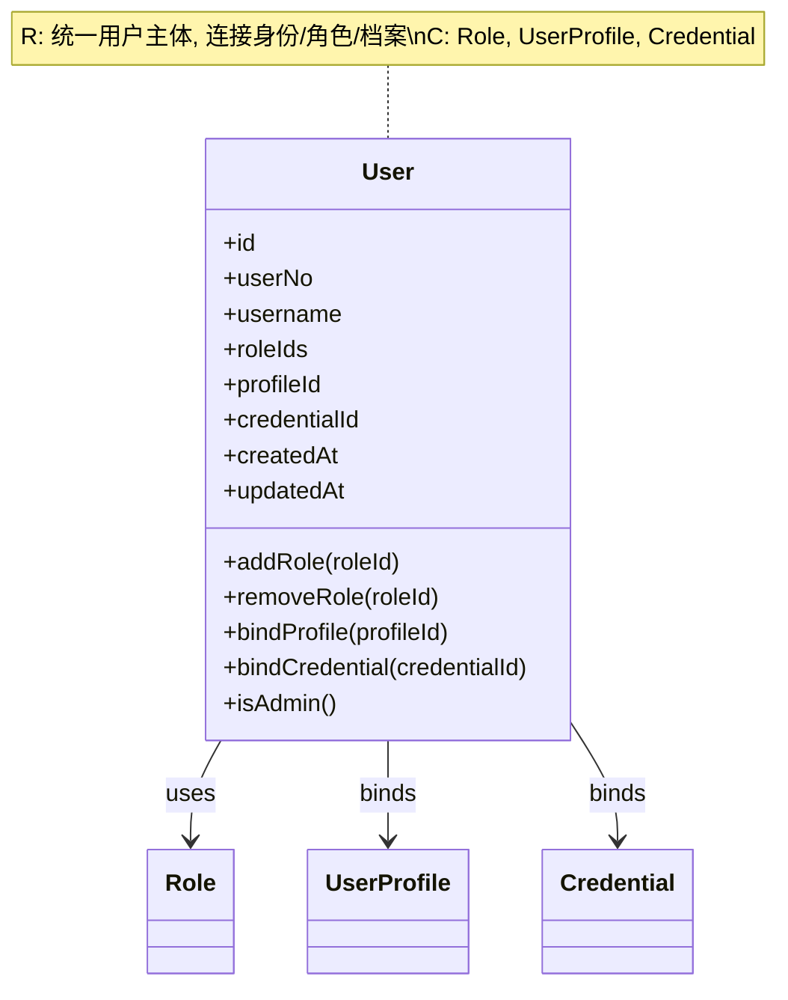
```mermaid
classDiagram
    class User {
        +id
        +userNo
        +username
        +roleIds
        +profileId
        +credentialId
        +createdAt
        +updatedAt
        +addRole(roleId)
        +removeRole(roleId)
        +bindProfile(profileId)
        +bindCredential(credentialId)
        +isAdmin()
    }
    User --> Role : uses
    User --> UserProfile : binds
    User --> Credential : binds
    note for User "R: 统一用户主体, 连接身份/角色/档案\nC: Role, UserProfile, Credential"
```

## 2. UserProfile

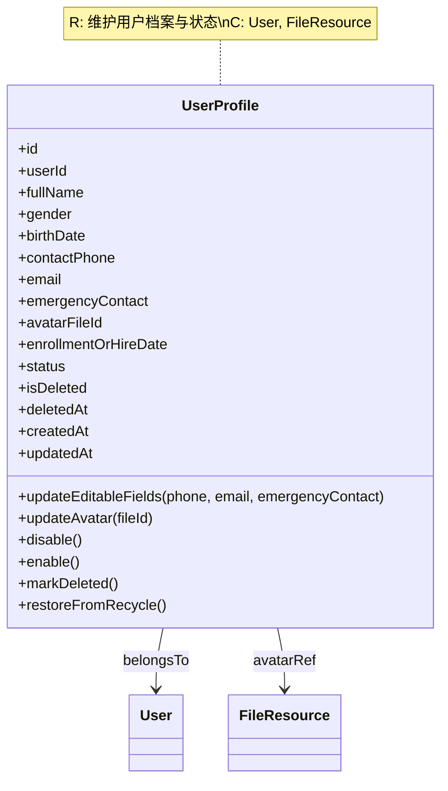
```mermaid
classDiagram
    class UserProfile {
        +id
        +userId
        +fullName
        +gender
        +birthDate
        +contactPhone
        +email
        +emergencyContact
        +avatarFileId
        +enrollmentOrHireDate
        +status
        +isDeleted
        +deletedAt
        +createdAt
        +updatedAt
        +updateEditableFields(phone, email, emergencyContact)
        +updateAvatar(fileId)
        +disable()
        +enable()
        +markDeleted()
        +restoreFromRecycle()
    }
    UserProfile --> User : belongsTo
    UserProfile --> FileResource : avatarRef
    note for UserProfile "R: 维护用户档案与状态\nC: User, FileResource"
```

## 3. Role

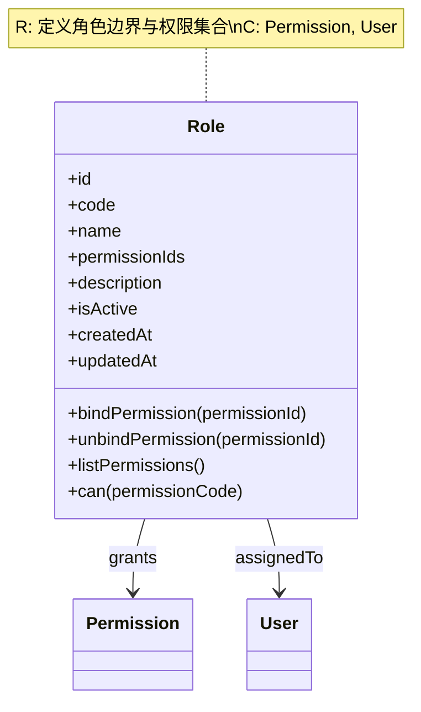
```mermaid
classDiagram
    class Role {
        +id
        +code
        +name
        +permissionIds
        +description
        +isActive
        +createdAt
        +updatedAt
        +bindPermission(permissionId)
        +unbindPermission(permissionId)
        +listPermissions()
        +can(permissionCode)
    }
    Role --> Permission : grants
    Role --> User : assignedTo
    note for Role "R: 定义角色边界与权限集合\nC: Permission, User"
```

## 4. Permission

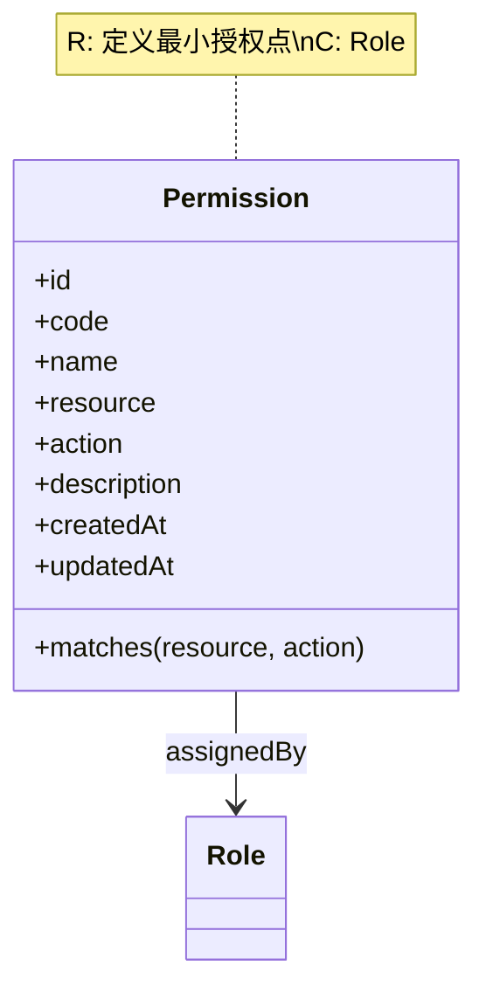
```mermaid
classDiagram
    class Permission {
        +id
        +code
        +name
        +resource
        +action
        +description
        +createdAt
        +updatedAt
        +matches(resource, action)
    }
    Permission --> Role : assignedBy
    note for Permission "R: 定义最小授权点\nC: Role"
```

## 5. Credential

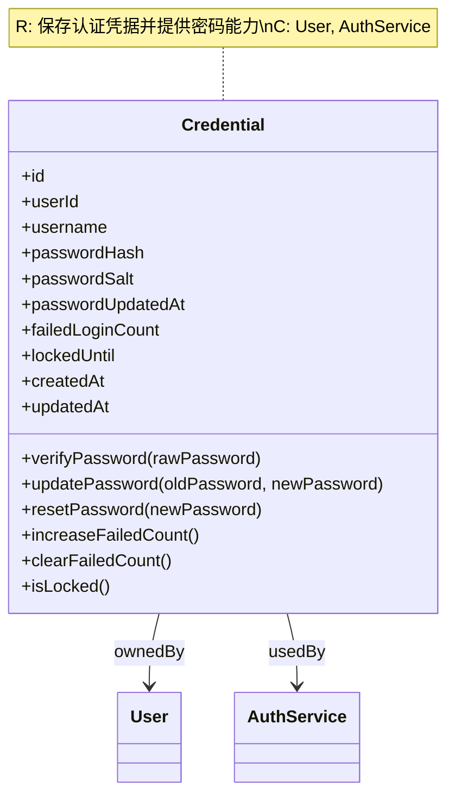
```mermaid
classDiagram
    class Credential {
        +id
        +userId
        +username
        +passwordHash
        +passwordSalt
        +passwordUpdatedAt
        +failedLoginCount
        +lockedUntil
        +createdAt
        +updatedAt
        +verifyPassword(rawPassword)
        +updatePassword(oldPassword, newPassword)
        +resetPassword(newPassword)
        +increaseFailedCount()
        +clearFailedCount()
        +isLocked()
    }
    Credential --> User : ownedBy
    Credential --> AuthService : usedBy
    note for Credential "R: 保存认证凭据并提供密码能力\nC: User, AuthService"
```

## 6. Token

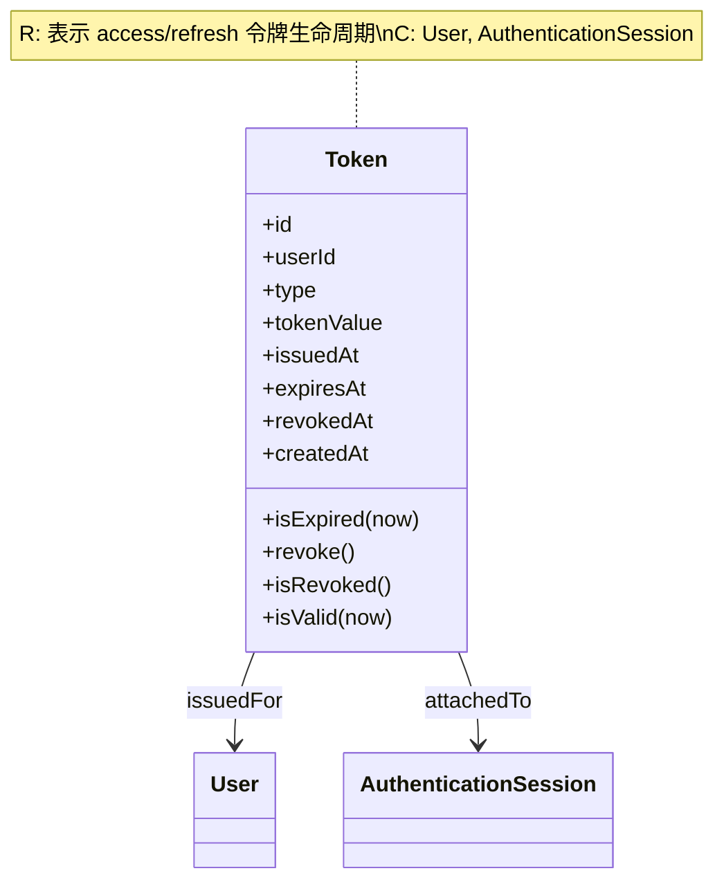
```mermaid
classDiagram
    class Token {
        +id
        +userId
        +type
        +tokenValue
        +issuedAt
        +expiresAt
        +revokedAt
        +createdAt
        +isExpired(now)
        +revoke()
        +isRevoked()
        +isValid(now)
    }
    Token --> User : issuedFor
    Token --> AuthenticationSession : attachedTo
    note for Token "R: 表示 access/refresh 令牌生命周期\nC: User, AuthenticationSession"
```

## 7. AuthenticationSession

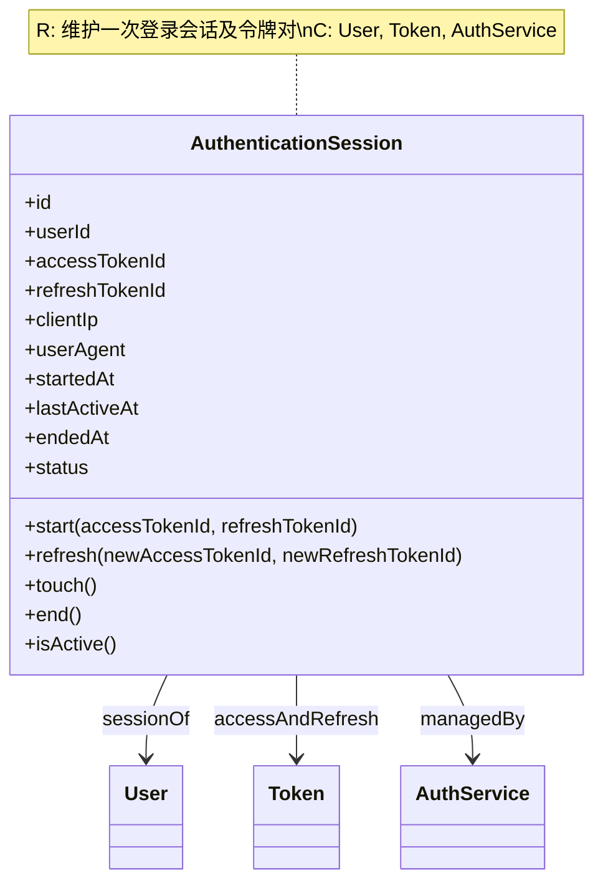
```mermaid
classDiagram
    class AuthenticationSession {
        +id
        +userId
        +accessTokenId
        +refreshTokenId
        +clientIp
        +userAgent
        +startedAt
        +lastActiveAt
        +endedAt
        +status
        +start(accessTokenId, refreshTokenId)
        +refresh(newAccessTokenId, newRefreshTokenId)
        +touch()
        +end()
        +isActive()
    }
    AuthenticationSession --> User : sessionOf
    AuthenticationSession --> Token : accessAndRefresh
    AuthenticationSession --> AuthService : managedBy
    note for AuthenticationSession "R: 维护一次登录会话及令牌对\nC: User, Token, AuthService"
```

## 8. Course

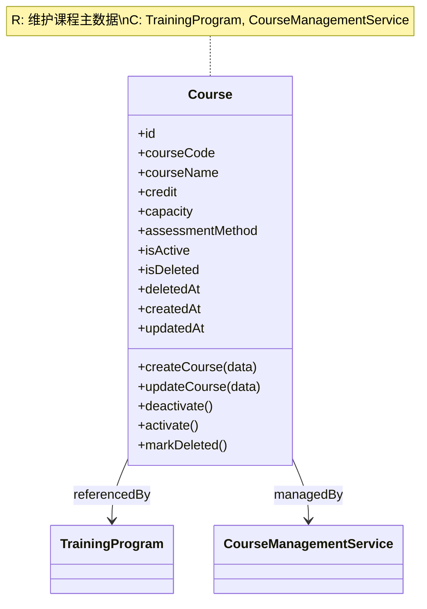
```mermaid
classDiagram
    class Course {
        +id
        +courseCode
        +courseName
        +credit
        +capacity
        +assessmentMethod
        +isActive
        +isDeleted
        +deletedAt
        +createdAt
        +updatedAt
        +createCourse(data)
        +updateCourse(data)
        +deactivate()
        +activate()
        +markDeleted()
    }
    Course --> TrainingProgram : referencedBy
    Course --> CourseManagementService : managedBy
    note for Course "R: 维护课程主数据\nC: TrainingProgram, CourseManagementService"
```

## 9. BaseInfoItem

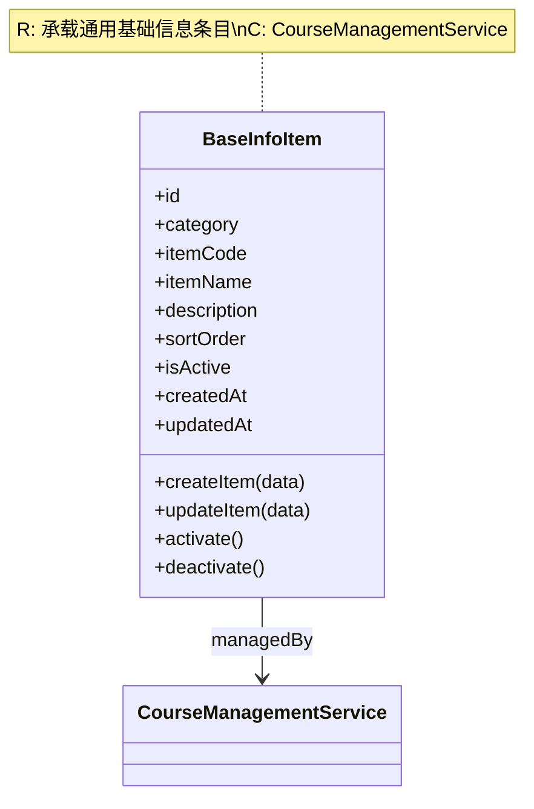
```mermaid
classDiagram
    class BaseInfoItem {
        +id
        +category
        +itemCode
        +itemName
        +description
        +sortOrder
        +isActive
        +createdAt
        +updatedAt
        +createItem(data)
        +updateItem(data)
        +activate()
        +deactivate()
    }
    BaseInfoItem --> CourseManagementService : managedBy
    note for BaseInfoItem "R: 承载通用基础信息条目\nC: CourseManagementService"
```

## 10. AcademicCalendar

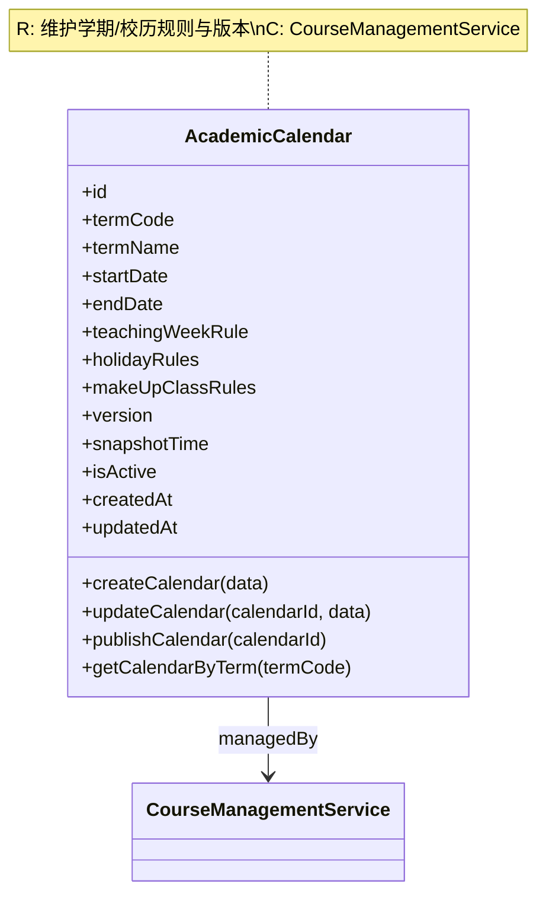
```mermaid
classDiagram
    class AcademicCalendar {
        +id
        +termCode
        +termName
        +startDate
        +endDate
        +teachingWeekRule
        +holidayRules
        +makeUpClassRules
        +version
        +snapshotTime
        +isActive
        +createdAt
        +updatedAt
        +createCalendar(data)
        +updateCalendar(calendarId, data)
        +publishCalendar(calendarId)
        +getCalendarByTerm(termCode)
    }
    AcademicCalendar --> CourseManagementService : managedBy
    note for AcademicCalendar "R: 维护学期/校历规则与版本\nC: CourseManagementService"
```

## 11. TrainingProgram

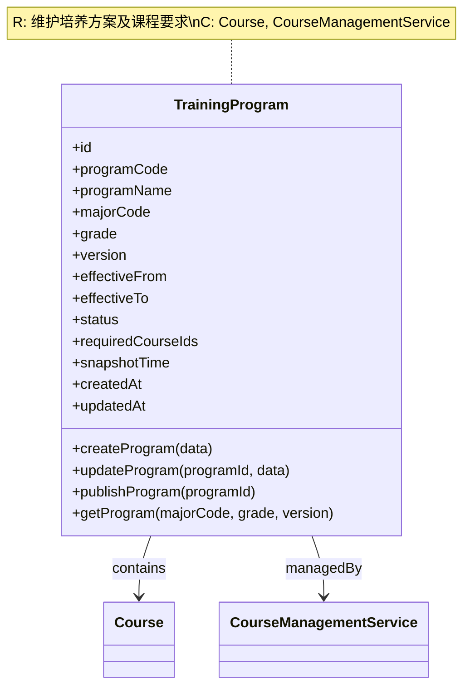
```mermaid
classDiagram
    class TrainingProgram {
        +id
        +programCode
        +programName
        +majorCode
        +grade
        +version
        +effectiveFrom
        +effectiveTo
        +status
        +requiredCourseIds
        +snapshotTime
        +createdAt
        +updatedAt
        +createProgram(data)
        +updateProgram(programId, data)
        +publishProgram(programId)
        +getProgram(majorCode, grade, version)
    }
    TrainingProgram --> Course : contains
    TrainingProgram --> CourseManagementService : managedBy
    note for TrainingProgram "R: 维护培养方案及课程要求\nC: Course, CourseManagementService"
```

## 12. FileResource

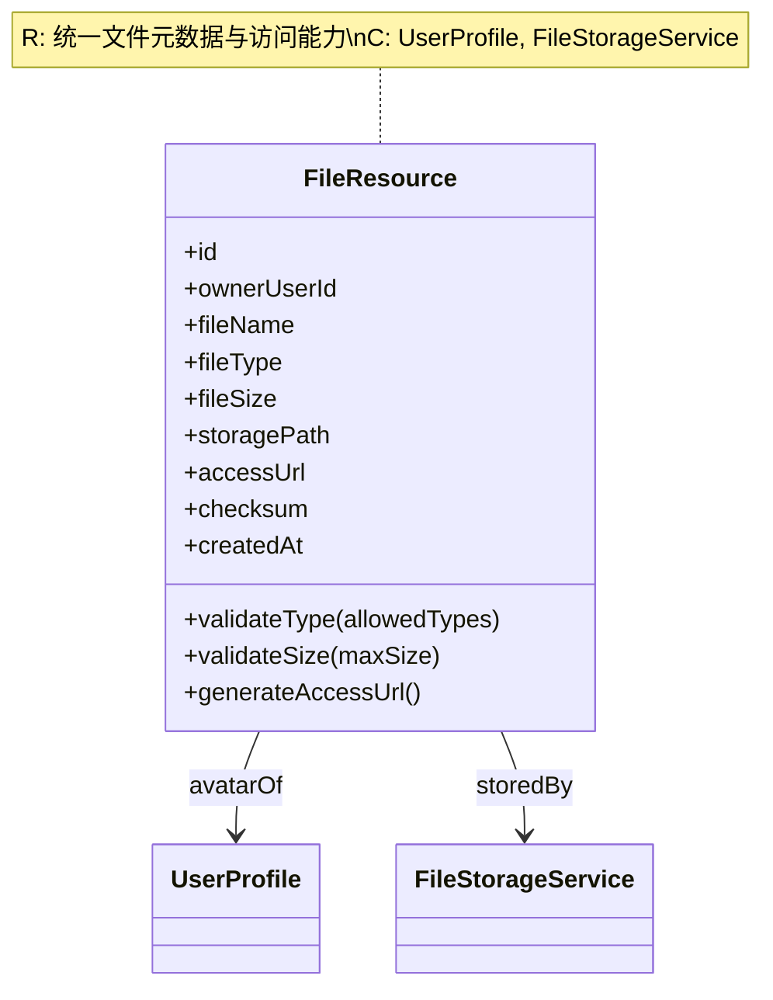
```mermaid
classDiagram
    class FileResource {
        +id
        +ownerUserId
        +fileName
        +fileType
        +fileSize
        +storagePath
        +accessUrl
        +checksum
        +createdAt
        +validateType(allowedTypes)
        +validateSize(maxSize)
        +generateAccessUrl()
    }
    FileResource --> UserProfile : avatarOf
    FileResource --> FileStorageService : storedBy
    note for FileResource "R: 统一文件元数据与访问能力\nC: UserProfile, FileStorageService"
```

## 13. AuditLog

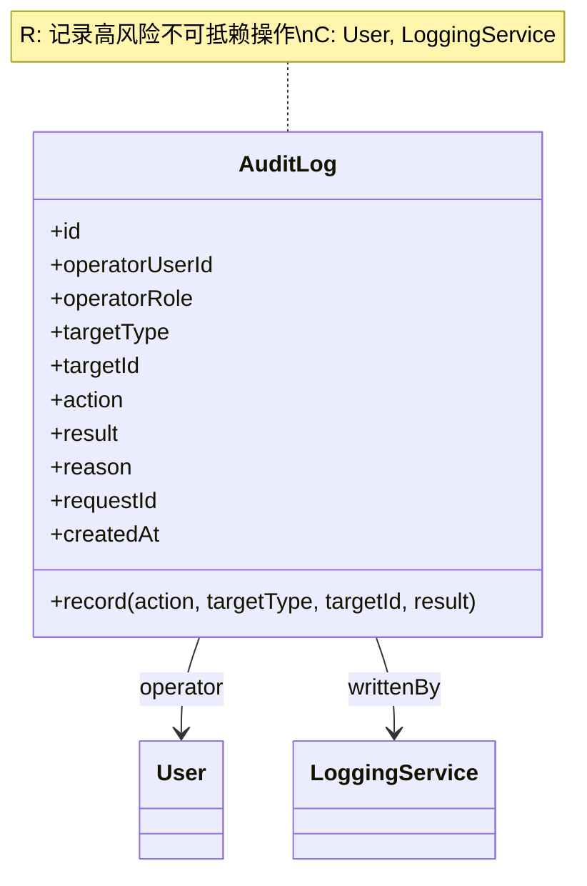
```mermaid
classDiagram
    class AuditLog {
        +id
        +operatorUserId
        +operatorRole
        +targetType
        +targetId
        +action
        +result
        +reason
        +requestId
        +createdAt
        +record(action, targetType, targetId, result)
    }
    AuditLog --> User : operator
    AuditLog --> LoggingService : writtenBy
    note for AuditLog "R: 记录高风险不可抵赖操作\nC: User, LoggingService"
```

## 14. AppLogger

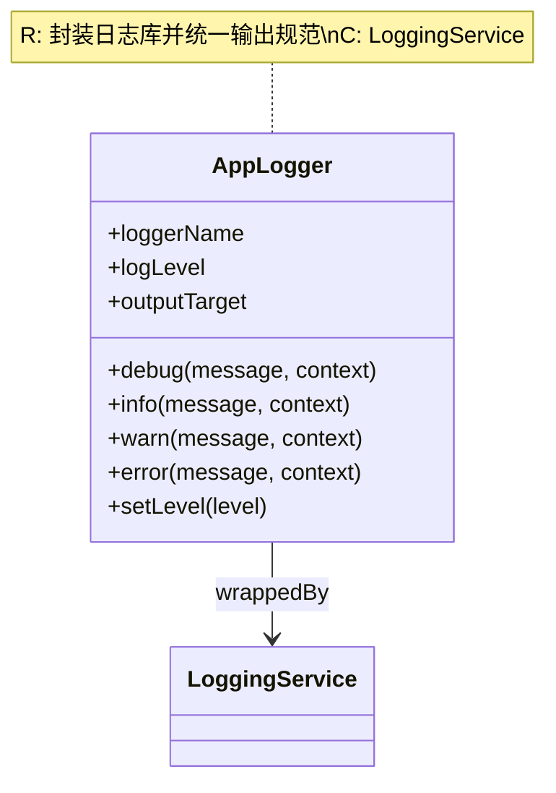
```mermaid
classDiagram
    class AppLogger {
        +loggerName
        +logLevel
        +outputTarget
        +debug(message, context)
        +info(message, context)
        +warn(message, context)
        +error(message, context)
        +setLevel(level)
    }
    AppLogger --> LoggingService : wrappedBy
    note for AppLogger "R: 封装日志库并统一输出规范\nC: LoggingService"
```

## 15. AuthService

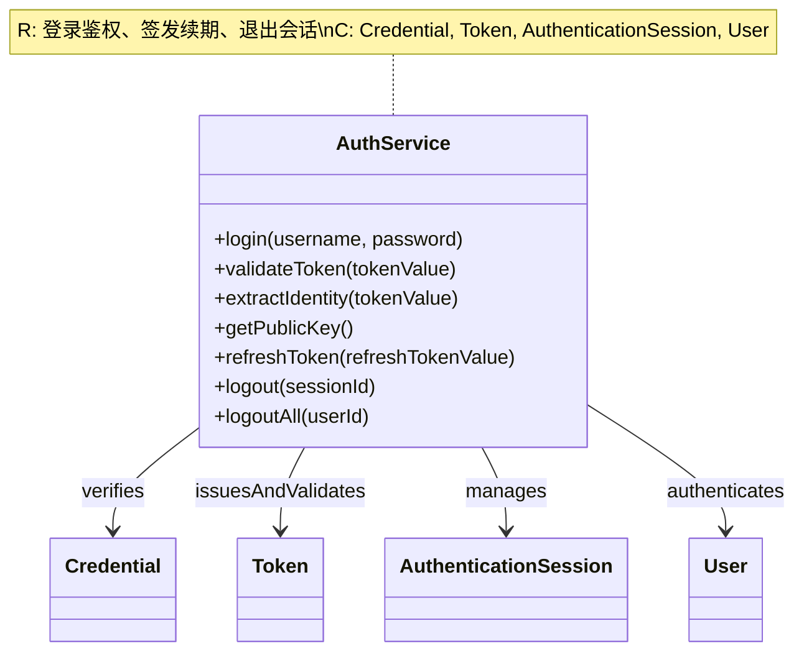
```mermaid
classDiagram
    class AuthService {
        +login(username, password)
        +validateToken(tokenValue)
        +extractIdentity(tokenValue)
        +getPublicKey()
        +refreshToken(refreshTokenValue)
        +logout(sessionId)
        +logoutAll(userId)
    }
    AuthService --> Credential : verifies
    AuthService --> Token : issuesAndValidates
    AuthService --> AuthenticationSession : manages
    AuthService --> User : authenticates
    note for AuthService "R: 登录鉴权、签发续期、退出会话\nC: Credential, Token, AuthenticationSession, User"
```

## 16. UserManagementService

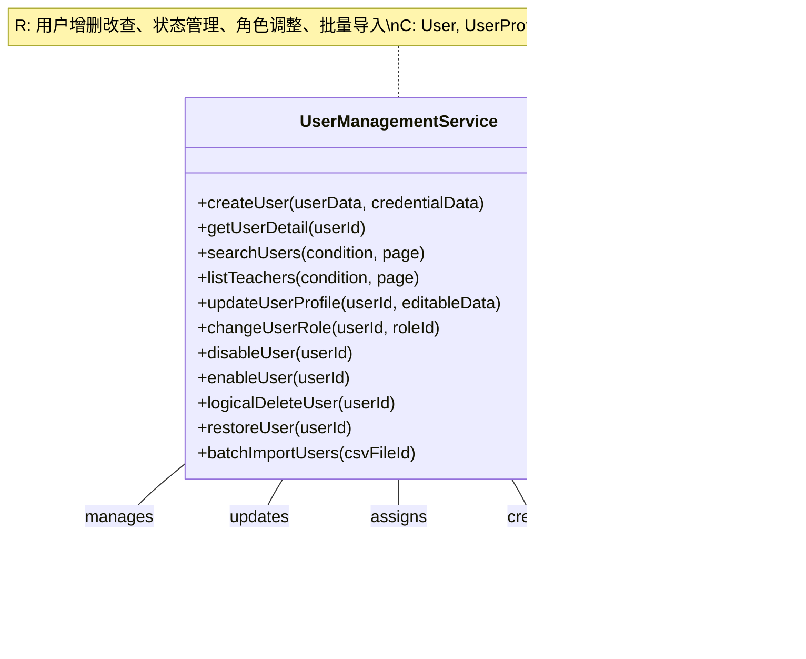
```mermaid
classDiagram
    class UserManagementService {
        +createUser(userData, credentialData)
        +getUserDetail(userId)
        +searchUsers(condition, page)
        +listTeachers(condition, page)
        +updateUserProfile(userId, editableData)
        +changeUserRole(userId, roleId)
        +disableUser(userId)
        +enableUser(userId)
        +logicalDeleteUser(userId)
        +restoreUser(userId)
        +batchImportUsers(csvFileId)
    }
    UserManagementService --> User : manages
    UserManagementService --> UserProfile : updates
    UserManagementService --> Role : assigns
    UserManagementService --> Credential : creates
    UserManagementService --> FileResource : imports
    note for UserManagementService "R: 用户增删改查、状态管理、角色调整、批量导入\nC: User, UserProfile, Role, Credential, FileResource"
```

## 17. CourseManagementService

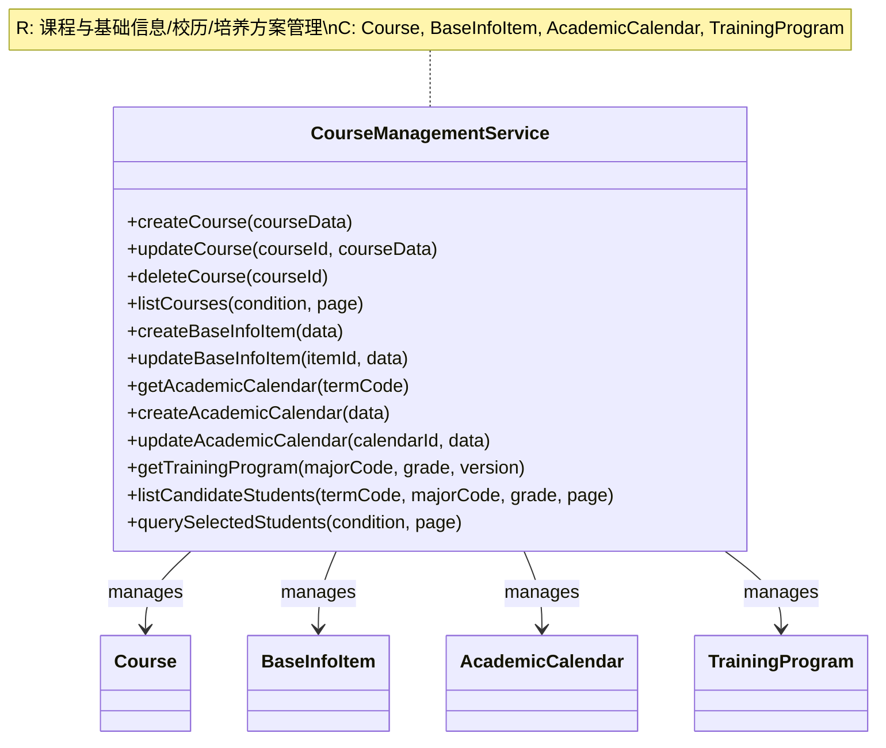
```mermaid
classDiagram
    class CourseManagementService {
        +createCourse(courseData)
        +updateCourse(courseId, courseData)
        +deleteCourse(courseId)
        +listCourses(condition, page)
        +createBaseInfoItem(data)
        +updateBaseInfoItem(itemId, data)
        +getAcademicCalendar(termCode)
        +createAcademicCalendar(data)
        +updateAcademicCalendar(calendarId, data)
        +getTrainingProgram(majorCode, grade, version)
        +listCandidateStudents(termCode, majorCode, grade, page)
        +querySelectedStudents(condition, page)
    }
    CourseManagementService --> Course : manages
    CourseManagementService --> BaseInfoItem : manages
    CourseManagementService --> AcademicCalendar : manages
    CourseManagementService --> TrainingProgram : manages
    note for CourseManagementService "R: 课程与基础信息/校历/培养方案管理\nC: Course, BaseInfoItem, AcademicCalendar, TrainingProgram"
```

## 18. LoggingService

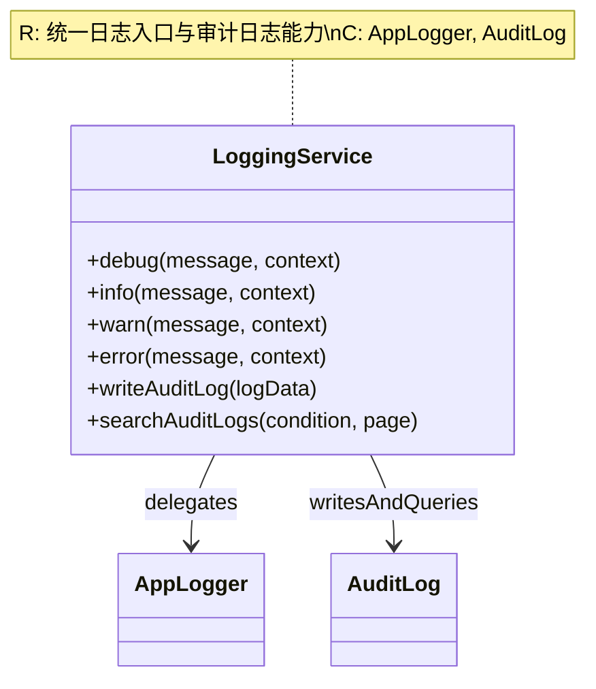
```mermaid
classDiagram
    class LoggingService {
        +debug(message, context)
        +info(message, context)
        +warn(message, context)
        +error(message, context)
        +writeAuditLog(logData)
        +searchAuditLogs(condition, page)
    }
    LoggingService --> AppLogger : delegates
    LoggingService --> AuditLog : writesAndQueries
    note for LoggingService "R: 统一日志入口与审计日志能力\nC: AppLogger, AuditLog"
```

## 19. FileStorageService

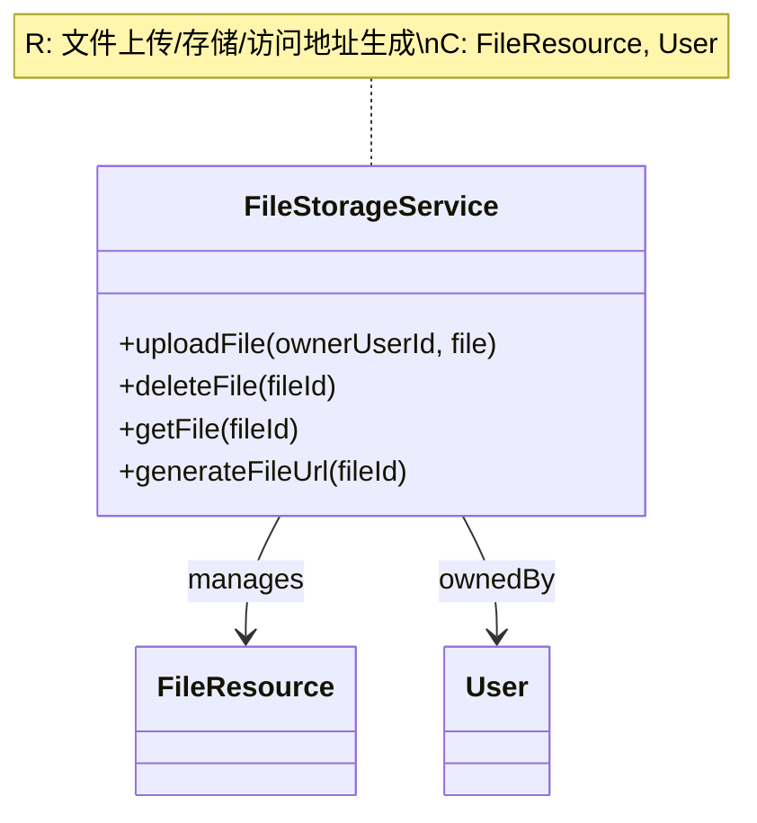
```mermaid
classDiagram
    class FileStorageService {
        +uploadFile(ownerUserId, file)
        +deleteFile(fileId)
        +getFile(fileId)
        +generateFileUrl(fileId)
    }
    FileStorageService --> FileResource : manages
    FileStorageService --> User : ownedBy
    note for FileStorageService "R: 文件上传/存储/访问地址生成\nC: FileResource, User"
```
