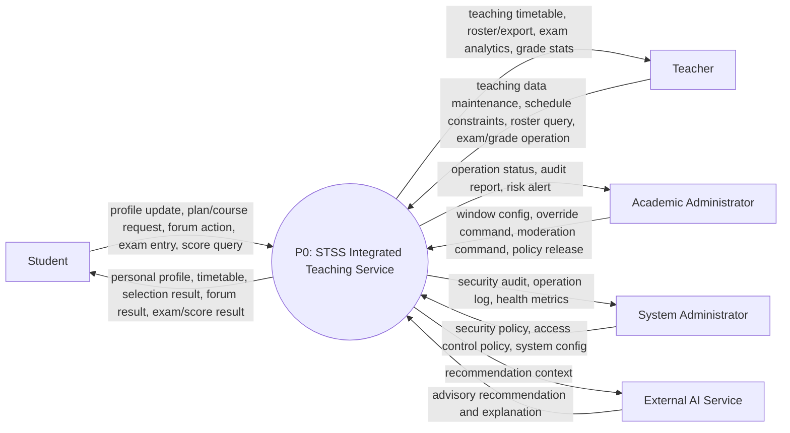
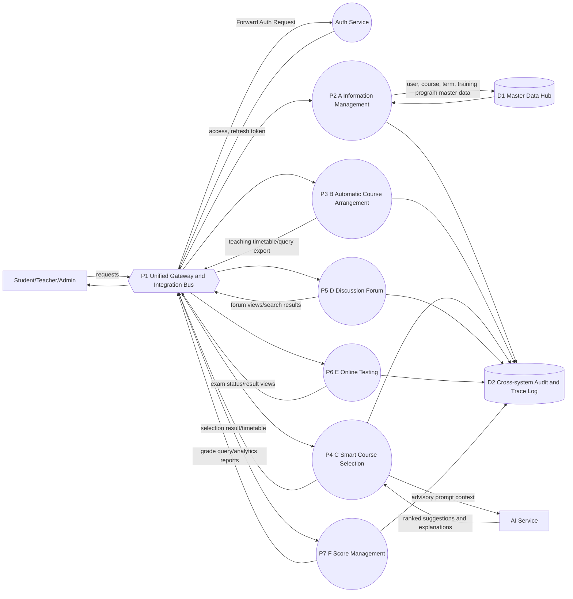
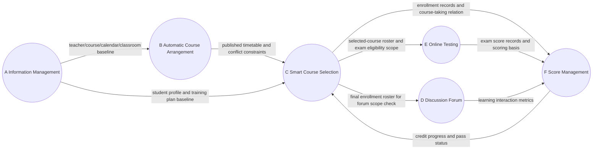
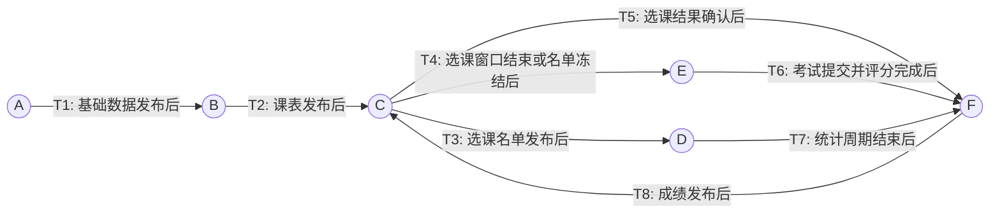
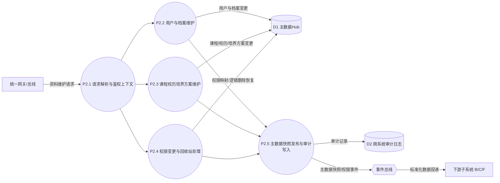
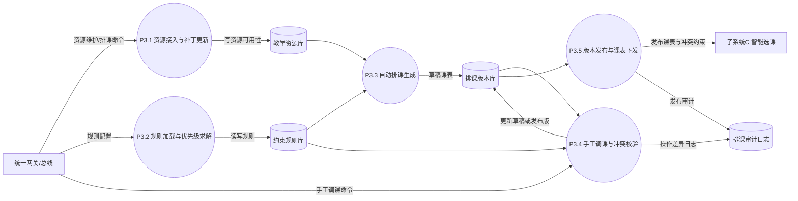
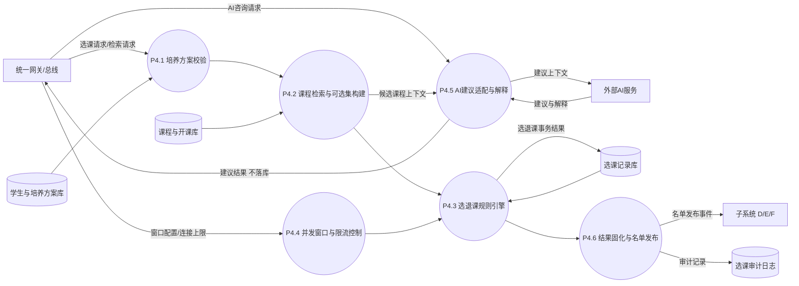
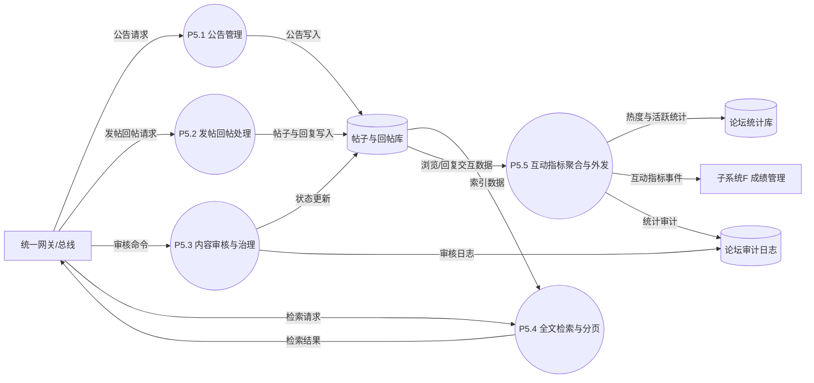
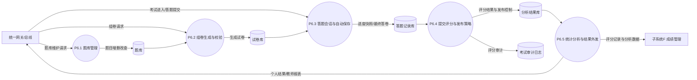
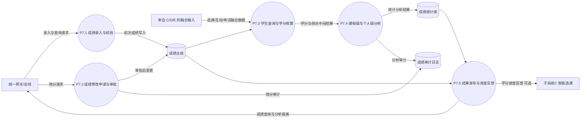

# STSS大组总线图整合版（L0-L2）

## 1. L0（Context）

### 1.1 图示

### 1.2 解释

#### 1.2.1 作用
- L0用于定义大组系统边界：把6个子系统抽象为一个整体服务 P0。
- L0只表达对外数据交换，不展开内部子系统实现。

#### 1.2.2 参与方与边界
- 外部实体包括学生、教师、教务管理员、系统管理员以及外部AI服务。
- 教务管理员与系统管理员是管理员群体的两种业务身份：前者偏业务运营治理，后者偏平台与安全治理。
- P0内部包含A~F六个子系统协同能力，但在L0不区分子系统。

#### 1.2.3 关键约束
- AI仅提供建议与解释，不直接写入业务主记录。
- 教务与系统管理分离：教务负责业务管控，系统管理员负责安全与平台策略。
- 对外响应遵循最小必要输出原则，避免跨角色越权数据泄露。

#### 1.2.4 与L1关系
- L0中的P0会在L1分解为A~F六个子系统与统一总线能力。
- L0中出现的外部输入输出，必须在L1映射到明确的子系统处理路径。

## 2. L1（Subsystem Decomposition）

### 2.1 图示

#### 2.1.1 整体关联图

#### 2.1.2 主链路数据流图

#### 2.1.3 主链路触发条件标注图

### 2.2 解释

#### 2.2.1 分解原则
- L1将L0中的P0分解为统一入口总线 + 6个业务子系统。
- 统一入口总线负责鉴权、路由编排、限流与审计聚合。
- 各业务子系统通过请求header读取uid与role进行业务处理，不重复做登录鉴权。
- 跨组数据流尽量通过标准接口或事件方式传递，降低点对点耦合。

#### 2.2.2 关键主链路
- 主链路图（2.1.2）已完整表达跨子系统业务主线，整体关联图（2.1.1）不再重复绘制同一批跨系统连线。
- 核心链路可归纳为三段：
1. A -> B -> C（基础数据供给与排课结果驱动选课）。
2. C -> D/E/F（选课结果复用到论坛、考试与成绩）。
3. E/D -> F（考试成绩与互动指标汇聚分析）。
- 可选闭环：F -> C 回传学分进展与通过状态，用于推荐优化与培养方案提示。

#### 2.2.3 总线化价值
- 降低耦合：外部实体统一接入BUS，子系统独立演进。
- 提升可治理性：统一限流、审计、告警、链路追踪。
- 便于扩展：未来新增子系统或外部服务只需接入总线层。

#### 2.2.4 实施注意点
- 必须统一跨组ID字典：UserId、CourseId、ClassId、TermId、PlanId、ExamId、ScoreId。
- 必须统一数据状态语义：Draft、Published、Archived。
- 必须统一事件可靠性策略：幂等键、重试、死信与回放机制。
- AI输出保持建议属性，禁止绕过业务规则直接落库。
- 业务权限判定规则由各子系统按role映射实现，避免把子系统授权策略耦合在A组。

## 3. L2（Subsystem Internal Data Flow）

### 3.1 L2 合约表（统一口径）

| L1过程 | L2子过程ID范围 | 关键输入 | 关键输出 | 主要读写存储 | 规则责任方 | 上下游交接 |
|---|---|---|---|---|---|---|
| P2 A信息管理 | P2.1-P2.5 | 用户/课程/权限维护请求 | 主数据快照、权限变更事件 | 主数据Hub、审计日志 | A规则引擎 | -> B/C/F |
| P3 B自动排课 | P3.1-P3.5 | 教学资源、排课规则、手工调课命令 | 已发布课表、冲突约束 | 资源库、版本库、规则库、审计日志 | B排课规则引擎 | -> C |
| P4 C智能选课 | P4.1-P4.6 | 培养方案、检索条件、选退课请求、AI建议请求 | 选课结果、名单发布、AI解释 | 培养方案库、开课库、选课记录库、审计日志 | C选课规则引擎 | -> D/E/F |
| P5 D讨论论坛 | P5.1-P5.5 | 公告/发帖/回帖/审核/检索请求 | 帖子结果、检索结果、互动指标 | 帖子库、统计库、审计日志 | D内容治理规则 | -> F |
| P6 E在线测试 | P6.1-P6.5 | 题库管理、组卷请求、答题提交 | 测试结果、评分记录、分析数据 | 题库、试卷库、答题库、分析库、审计日志 | E考试规则引擎 | -> F |
| P7 F成绩管理 | P7.1-P7.5 | 成绩录入/修改、成绩查询、上游融合数据 | 成绩统计、学分进度反馈 | 成绩库、统计库、审计日志 | F成绩治理规则 | -> C（可选闭环） |

### 3.2 各子系统 L2 分解（图示与解释）

#### 3.2.1 A 信息管理（P2）

##### 图示

##### 解释
- 输入：资料维护请求进入 P2.1，完成上下文解析后分流到用户、课程和权限处理链路。
- 处理：P2.2-P2.4 分别完成主数据维护、权限变更与回收站语义处理。
- 输出：P2.5 统一写入审计，并通过事件总线发布标准主数据快照供 B/C/F 消费。
- 治理点：写路径包含校验、持久化、审计三个环节，满足 L2 治理约束。

#### 3.2.2 B 自动排课（P3）

##### 图示

##### 解释
- 输入：资源维护命令、规则配置命令、手工调课命令。
- 处理：P3.1-P3.3 完成资源准备、规则求解和自动排课；P3.4 完成人工调整与冲突校验。
- 输出：P3.5 对外发布课表与冲突约束至 C，并写入发布审计。
- 治理点：自动与手工两条路径均汇聚到版本库，避免发布口径不一致。

#### 3.2.3 C 智能选课（P4）

##### 图示

##### 解释
- 输入：选课/检索请求、窗口与并发控制配置、AI 咨询请求。
- 处理：P4.1-P4.4 完成方案校验、可选集构建、规则引擎判定与窗口限流；P4.5 单独处理 AI 建议。
- 输出：P4.6 固化选课结果并向 D/E/F 发布名单事件，同时写入审计日志。
- 治理点：AI 结果只用于建议展示，不直接落事务库，符合“AI 不直写”原则。

#### 3.2.4 D 讨论论坛（P5）

##### 图示

##### 解释
- 输入：公告请求、发帖回帖请求、审核命令、检索请求。
- 处理：P5.1-P5.4 分别承担公告、内容写入、审核治理、全文检索；P5.5 聚合互动指标。
- 输出：论坛读写结果返回总线，互动指标周期性输出给 F。
- 治理点：审核与统计过程均写审计日志，保证内容治理可追踪。

#### 3.2.5 E 在线测试（P6）

##### 图示

##### 解释
- 输入：题库维护、组卷请求、考试进入与答题提交请求。
- 处理：P6.1-P6.3 完成题库管理、组卷生成、会话与自动保存；P6.4 完成评分与发布控制。
- 输出：P6.5 对内返回个人结果/教师报表，对外向 F 发送评分与分析数据。
- 治理点：评分流程与发布策略分离，避免“计算完成即自动发布”的治理风险。

#### 3.2.6 F 成绩管理（P7）

##### 图示

##### 解释
- 输入：录入/改分/查询请求，以及来自 C/D/E 的融合数据。
- 处理：P7.1-P7.4 完成录入、受控改分、学分核算与统计分析。
- 输出：P7.5 统一发布成绩查询与分析报表，并可选回传学分进度至 C。
- 治理点：改分链路独立建模并审计，满足“二次修改可控、可追溯”要求。
