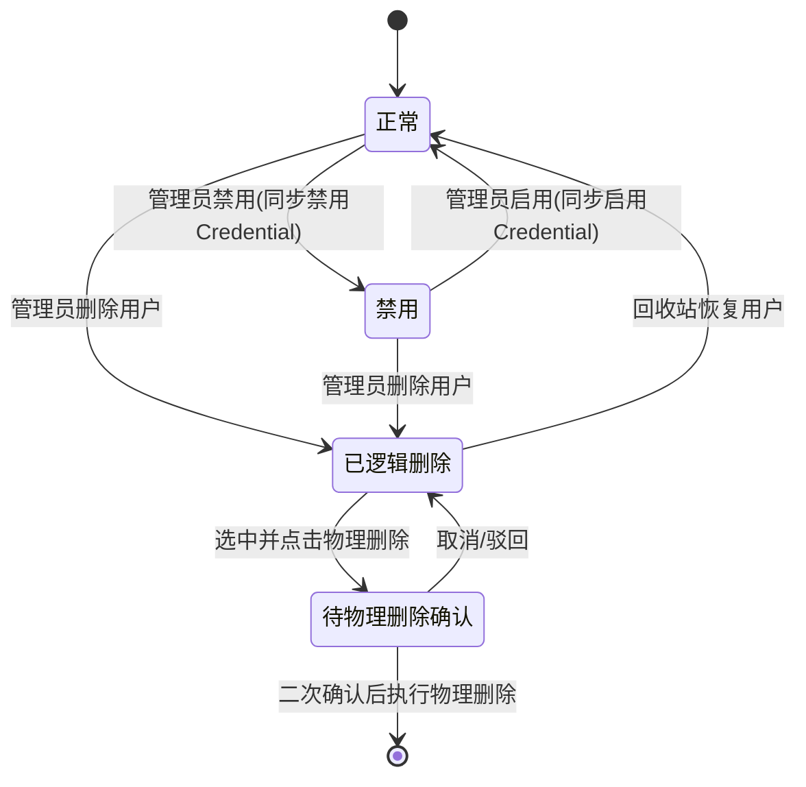
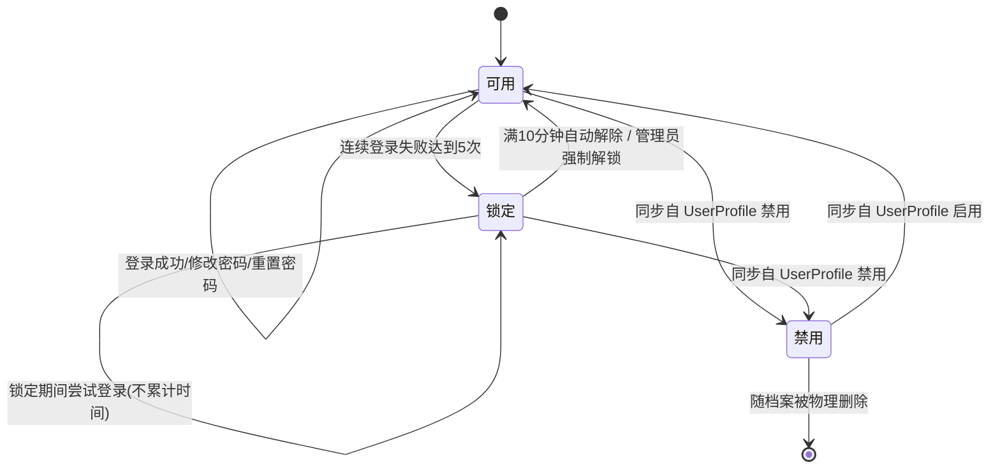
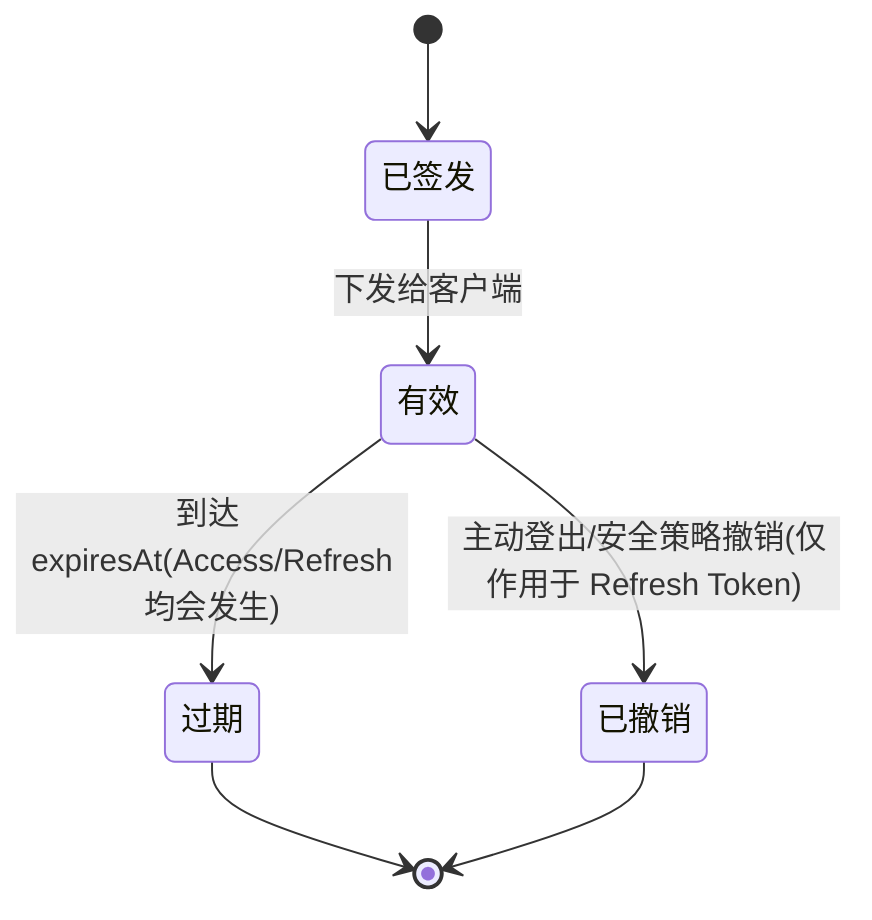
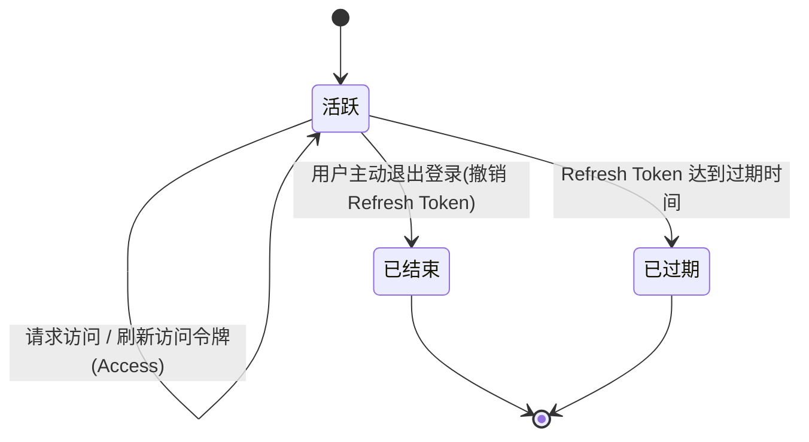

# 状态图（State Diagram）

## 第一步：筛选需要绘制状态图的类

仅对“具有明确生命周期、状态可迁移且会影响业务规则”的类绘制状态图。

需要绘制：
- UserProfile：存在 ACTIVE、DISABLED、DELETED 等状态与恢复流程。
- Credential：存在失败次数累计、锁定、解锁等状态迁移。
- Token：存在签发、生效、过期、撤销等状态迁移。
- AuthenticationSession：存在 ACTIVE、ENDED、EXPIRED 等会话状态迁移。

不优先绘制（或不绘制）：
- Course：根据最新确认，不绘制状态图。
- User、Role、Permission、AuditLog、AppLogger、各 Service 类：当前定义更偏“关系/能力描述”，缺少清晰的状态机事件与状态边界。

## 第二步：分别绘制状态图

### 1) UserProfile
（包含了物理删除的二次确认与状态流转约定）

### 2) Credential
（按照失败5次锁定10分钟，不支持指数退避，支持管理员强制解除绘制）

### 3) Token
（明确 Access 仅自然过期，Refresh 可被撤销）

### 4) AuthenticationSession
（明确仅通过 Refresh Token 的失效来判定 Session 过期）

## 业务规则说明（基于确认信息的补充）
1. **账号锁定与解锁**：连续失败5次后锁定10分钟，不支持指数退避。满10分钟后自动解除，同时允许管理员强制解除锁定状态。
2. **账号生命周期联动**：UserProfile 状态变更为“禁用”或“启用”时，需同步联动到对应的 Credential 禁用/启用（如状态图所示）。
3. **退出的 Token 更新机制**：主动退出或结束会话时，仅作废 Refresh Token。下发在客户端既有的 Access Token 等待其自然到期，实现轻量级注销。
4. **Session 状态判定**：AuthenticationSession 的生命与终结，统一以 Refresh Token 失效为准。
5. **物理删除保护**：对用户的物理删除属于高危操作，强制要求系统进入“二次确认”阶段，以防误删。
